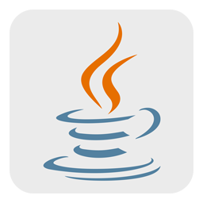
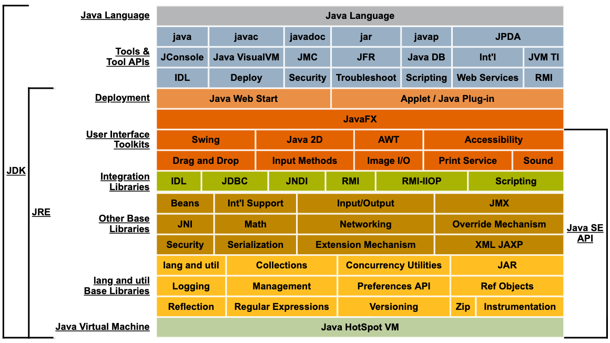

# Java 是什么？及 Java 语言的特点  | No.0

[Java](https://www.java.com/zh_CN/) 是近 10 年来计算机软件发展过程中的传奇，其在众多开发者心中的地位可谓
“爱不释手”，与其他一些计算机语言随着时间的流逝影响也逐渐减弱不同，Java 随着时间的推移反而变得更加强大。

从首次发布开始，Java 就跃到了 Internet 编程的前沿。后续的每一个版本都进一步巩固了这一地位。
如今，Java 依然是开发基于 Web 的应用程序的最佳选择。

此外，Java 还是智能手机变革的推手，[Android](https://developer.android.com/?hl=zh-cn) 编程采用的就是 Java 语言。

PS：(2019-07-30注)目前已经换成  Kotlin 了。详情可查看：http://t.cn/EoKGAyJ

#### 一、什么是 Java 语言

简单地说，Java 是由 Sun Microsystems 公司于 1995 年推出的一门面向对象程序设计语言。
2010 年 Oracle 公司收购 Sun Microsystems，之后由 Oracle 公司负责 Java 的维护和版本升级。

其实，Java 还是一个平台。

Java 平台由 Java 虚拟机（Java Virtual Machine，JVM）和 Java 应用编程接口（Application Programming Interface，API）构成。

Java 应用编程接口为此提供了一个独立于操作系统的标准接口，可分为基本部分和扩展部分。在硬件或操作系统平台上安装一个 Java 平台之后，Java 应用程序就可运行。

Java 平台已经嵌入了几乎所有的操作系统。
这样 Java 程序只编译一次，就可以在各种系统中运行。
Java 应用编程接口已经从 1.1x 版本发展到 1.2 版本。
常用的 Java 平台基于 Java 1.6，目前企业都逐渐将版本切换到了Java 1.8，最新版本为 Java 12。

Java 发展至今，就力图使之无所不能。
按应用范围，Java 可分为 3 个体系，即 Java SE、Java EE 和 Java ME。

下面简单介绍这 3 个体系。

##### 1. Java SE

Java SE（Java Platform Standard Edition，Java 平台标准版）以前称为 J2SE，它允许开发和部署在桌面、服务器、嵌入式环境和实时环境中使用的 Java 应用程序。Java SE 包含了支持 Java Web 服务开发的类，并为 Java EE 提供基础，如 Java 语言基础、JDBC 操作、I/O 操作、网络通信以及多线程等技术。下图 所示为 Java SE 的体系结构。

##### 2. Java EE

Java EE（Java Platform Enterprise Edition，Java 平台企业版）以前称为 J2EE。企业版本帮助开发和部署可移植、健壮、可伸缩且安全的服务器端 Java 应用程序。

Java EE 是在 Java SE 基础上构建的，它提供 Web 服务、组件模型、管理和通信 API，可以用来实现企业级的面向服务体系结构（Service Oriented Architecture，SOA）和 Web 2.0 应用程序。

##### 3. Java ME

Java ME（Java Platform Micro Edition，Java 平台微型版）以前称为 J2ME，也叫 K-JAVA。

Java ME 为在移动设备和嵌入式设备（比如手机、PDA、电视机顶盒和打印机）上运行的应用程序提供一个健壮且灵活的环境。

Java ME 包括灵活的用户界面、健壮的安全模型、丰富的内置网络协议以及对可以动态下载的联网和离线应用程序。

基于 Java ME 规范的应用程序 只需编写一次就可以用于许多设备，而且可以利用每个设备的本机功能。

#### 二、Java 语言的特点

Java 语言的风格很像 C 语言和 [C++](http://c.biancheng.net/cplus/) 语言，是一种纯粹的面向对象语言，它继承了 C++ 语言面向对象的技术核心，但是拋弃了 C++ 的一些缺点，比如说容易引起错误的指针以及多继承等，同时也增加了垃圾回收机制，释放掉不被使用的内存空间，解决了管理内存空间的烦恼。

Java 语言是一种分布式的面向对象语言，具有面向对象、平台无关性、简单性、解释执行、多线程、安全性等很多特点，下面针对这些特点进行逐一介绍。

##### 1. 面向对象

Java 是一种面向对象的语言，它对对象中的类、对象、继承、封装、多态、接口、包等均有很好的支持。

为了简单起见，Java 只支持类之间的单继承，但是可以使用接口来实现多继承。使用 Java 语言开发程序，需要采用面向对象的思想设计程序和编写代码。

##### 2. 平台无关性

平台无关性的具体表现在于，Java 是 “一次编写，到处运行（Write Once，Run any Where）” 的语言，因此采用 Java 语言编写的程序具有很好的可移植性，而保证这一点的正是 Java 的虚拟机机制。

在引入虚拟机之后，Java 语言在不同的平台上运行不需要重新编译。

Java 语言使用 Java 虚拟机机制屏蔽了具体平台的相关信息，使得 Java 语言编译的程序只需生成虚拟机上的目标代码，就可以在多种平台上不加修改地运行。

##### 3. 简单性

Java 语言的语法与 C 语言和 C++ 语言很相近，使得很多程序员学起来很容易。

对 Java 来说，它舍弃了很多 C++ 中难以理解的特性，如操作符的重载和多继承等，而且 Java 语言不使用指针，加入了垃圾回收机制，解决了程序员需要管理内存的问题，使编程变得更加简单。

##### 4. 解释执行

Java 程序在 Java 平台运行时会被编译成字节码文件，然后可以在有 Java 环境的操作系统上运行。

在运行文件时，Java 的解释器对这些字节码进行解释执行，执行过程中需要加入的类在连接阶段被载入到运行环境中。

##### 5. 多线程

Java 语言是多线程的，这也是 Java 语言的一大特性，它必须由 Thread 类和它的子类来创建。

Java 支持多个线程同时执行，并提供多线程之间的同步机制。任何一个线程都有自己的 run() 方法，要执行的方法就写在 run() 方法体内。

##### 6. 分布式

Java 语言支持 Internet 应用的开发，在 Java 的基本应用编程接口中就有一个网络应用编程接口，它提供了网络应用编程的类库，包括 URL、URLConnection、Socket 等。

Java 的 RIM 机制也是开发分布式应用的重要手段。

##### 7. 健壮性

Java 的强类型机制、异常处理、垃圾回收机制等都是 Java 健壮性的重要保证。
对指针的丢弃是 Java 的一大进步。

另外，Java 的异常机制也是健壮性的一大体现。

##### 8. 高性能

Java 的高性能主要是相对其他高级脚本语言来说的，随着 JIT（Just in Time）的发展，Java 的运行速度也越来越高。

##### 9. 安全性

Java 通常被用在网络环境中，为此，Java 提供了一个安全机制以防止恶意代码的攻击。

除了 Java 语言具有许多的安全特性以外，Java 还对通过网络下载的类增加一个安全防范机制，分配不同的名字空间以防替代本地的同名类，并包含安全管理机制。

Java 语言的众多特性使其在众多的编程语言中占有较大的市场份额，Java 语言对对象的支持和强大的 API 使得编程工作变得更加容易和快捷，大大降低了程序的开发成本。

Java 的 “一次编写，到处执行” 正是它吸引众多商家和编程人员的一大优势。

#### 三、学习 Java 的最佳途径

学习 Java 之前，先别急，静下心来好好想想下面的问题。

1.  你对学习 Java 是否有足够兴趣？
2.  你是否能静下心来坚持不懈地学习？

以上是两个容易回答但绝对不应该忽略的问题。如果确信自己对 Java 感兴趣，而且又有吃苦的准备，那才可能学好 Java。

如果具备这两个条件，初学者需要注意的主要有如下几点。

1.  不要看太多的书，先找本相对基础的书系统地学习。很多程序开发人员工作了很久也只是熟悉部分基础而已，所以没有必要花费精力全面了解 Java 的每个细节。
2. 初学时不要去死记语法。在刚接触 Java 语言时，掌握好基础语法，并大概了解一些功能即可。借助开发工具的代码辅助功能完成代码的录入，这样可以更快地进入学习状态。
3. 多实践，多思考，多请教。仅读懂书中的内容和技术是不行的，必须动手编写程序代码、运行代码，并分析运行过程，从而对学习内容有整体的认识。用自己的方式思考问题，通过编写代码来提高编程思路。平时多和其他人沟通技术问题，提高自己的技术和见识。
4. 遇到问题，首先尝试自己解决。这样可以提高自己对程序的调试能力，并对常见问题有一定了解，明白出错的原因，甚至举一反三地解决其他相关联的错误问题。
5. 不要急躁，遇到技术问题，必须冷静对待，不能让思维混乱，保持清醒的头脑才能分析和解决各种问题。
6. 了解[设计模式](http://c.biancheng.net/design_pattern/)。开发程序必须编写程序代码，这些代码必须具有高度的可读性，这样编写的程序才有调试和维护的价值。学习一些设计模式，能够很好地把握项目的整体结构。
7. 多阅读别人的源代码，多査阅资料。不但要看懂别人的程序代码，还要分析作者的编程思想和设计模式，最好能为己所用。

##### 参考链接

1. https://www.java.com/zh_CN/about/whatis_java.jsp
2. http://c.biancheng.net/view/1282.html