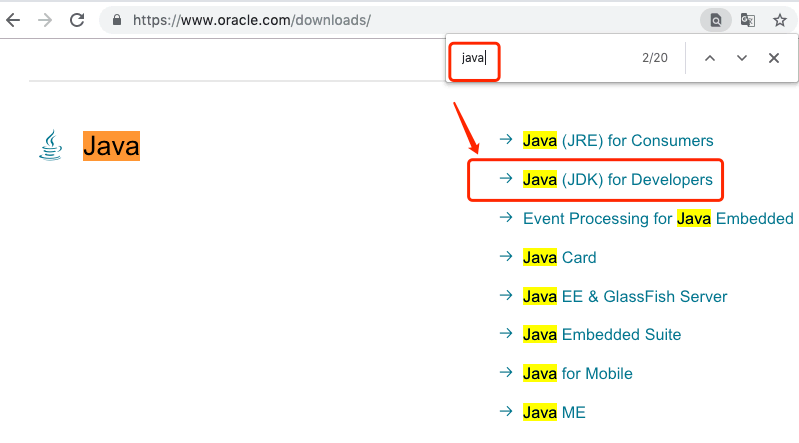
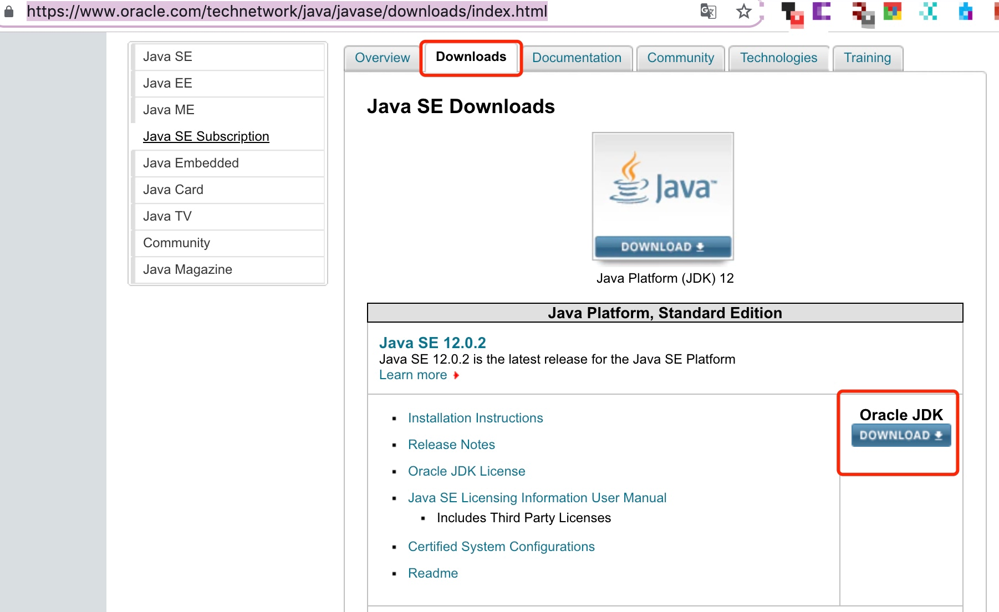
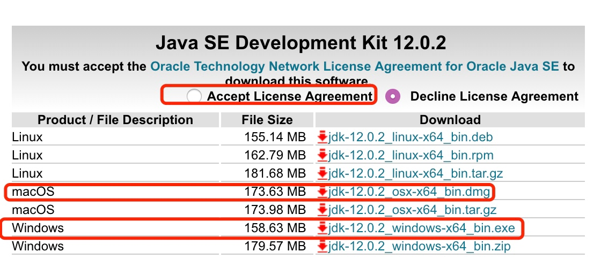
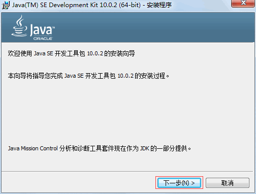
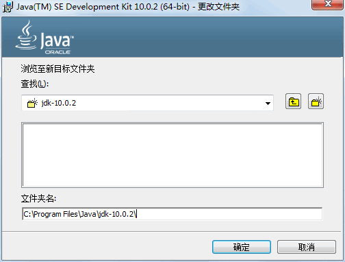
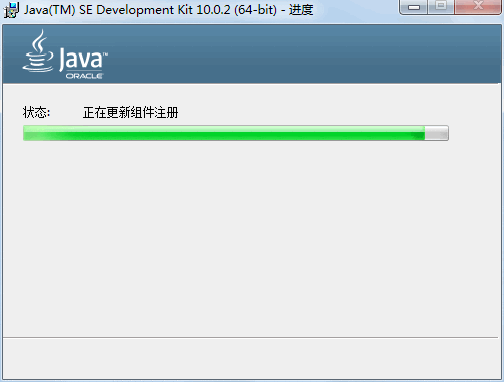
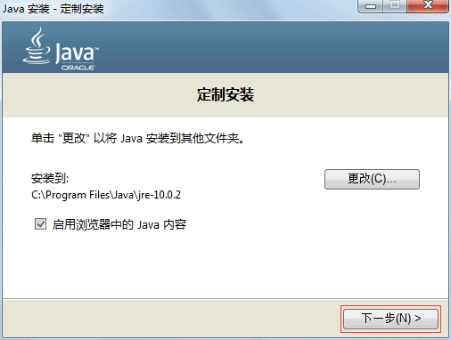
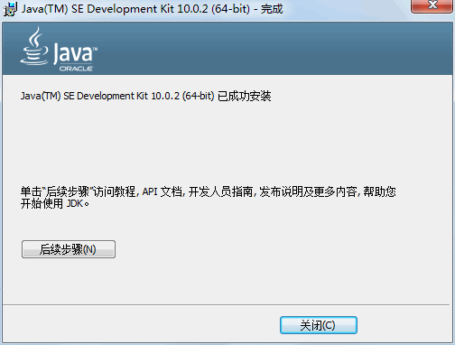
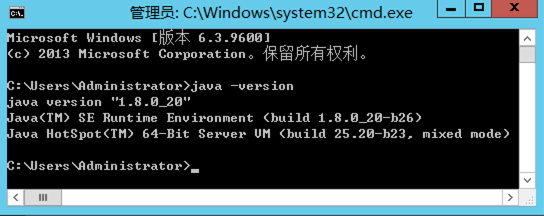
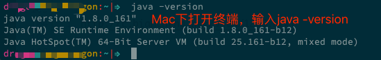

### Java环境：JDK下载与安装教程

本文内容：

- [x] JDK 下载 & 安装
- [x] 校验是否安装成功

#### 一、JDK 下载 & 安装

万事开头难。在了解什么是Java、Java 语言的特点以及学习方法之后，本节将介绍如何搭建编写 Java 程序所需要的开发环境——JDK（Java Development Kit）。

JDK 是一种用于构建在 Java 平台上发布的应用程序、Applet 和组件的开发环境，即编写 Java 程序必须使用 JDK，它提供了编译和运行 Java 程序的环境。

在安装 JDK 之前，首先要到 Oracle 网站获取 JDK 安装包。
JDK 安装包被集成在 Java SE 中，因此下载 Java SE 即可，具体步骤如下。

(1) 在浏览器中输入 <https://www.oracle.com/downloads/>



在页面搜索 java (Ctrl + F)，在页面中选择 Java for Developers 选项，如上图所示。

单击 Java for Developers 超链接，进入 Java SE 的下载页面。

<https://www.oracle.com/technetwork/java/javase/downloads/index.html>

<br/>

> 提示：由于 Java 版本不断更新，当读者浏览 JavaSE 的下载页面时，显示的是当前最新的版本。

<br/>

在进入的 JDK 下载页面中包括 Windows、Mac 和 Linux等平台的不同环境 JDK 的下载链接。




(2) 在下载之前需要选中**Accept License Agreement** 单选按钮，接受许可协议。

因此这里需要选择与平台相对应的 x64 类型的 jdk-windows/osx -x64 超链接，对 JDK 进行下载。



(3)下载完成后，在磁盘中会发现一个名称为 jdk-xxx-windows-x64.exe 的可执行文件。
双击该文件，打开 JDK 的欢迎界面。




(4) 单击“下一步”按钮，打开定制安装对话框。选择安装的 JDK 组件。


(5) 单击“更改”按钮，可以更改 JDK 的安装路径。更改完成之后，单击“下一步”按钮，打开安装进度界面。






(6)在安装过程中会打开目标文件夹对话框，选择 JRE 的安装路径，这里使用默认值。




(7) 单击“下一步”按钮，安装 JRE。

当 JRE 安装完成之后，将打开 JDK 安装完成界面，如图所示。




安装完成后，在安装位置打开 JDK 的文件夹，内容和目录结构如图 所示。


从图可以看出，JDK 安装目录下具有多个子目录和一些网页文件，其中重要目录和文件的说明如下。

**bin**：提供 JDK 工具程序，包括 javac、java、javadoc、appletviewer 等可执行程序。
**include**：存放用于本地访问的文件。
**jre**：存放 Java 运行环境文件。
**lib**：存放 Java 的类库文件，工具程序实际上使用的是 Java 类库。JDK 中的工具程序，大多也由 Java 编写而成。
**src.zip**：Java 提供的 API 类的源代码压缩文件。如果需要查看 API 的某些功能是如何实现的，可以査看这个文件中的源代码内容。

---

#### 二、校验JDK是否安装成功

(1) 打开cmd


(2) 输入 java -version

```bash
java -version
```

Windows检查JDK安装是否成功：




Mac下检查JDK安装是否成功：




(3) 查询java命令的帮助文档(其他命令同理)

```bash
java -help
```

如输入 `java -help` 得到的结果：java命令详解。

```bash
用法: java [-options] class [args...]
           (执行类)
   或  java [-options] -jar jarfile [args...]
           (执行 jar 文件)
其中选项包括:
    -d32	  使用 32 位数据模型 (如果可用)
    -d64	  使用 64 位数据模型 (如果可用)
    -server	  选择 "server" VM
                  默认 VM 是 server,
                  因为您是在服务器类计算机上运行。


    -cp <目录和 zip/jar 文件的类搜索路径>
    -classpath <目录和 zip/jar 文件的类搜索路径>
                  用 : 分隔的目录, JAR 档案
                  和 ZIP 档案列表, 用于搜索类文件。
    -D<名称>=<值>
                  设置系统属性
    -verbose:[class|gc|jni]
                  启用详细输出
    -version      输出产品版本并退出
    -version:<值>
                  警告: 此功能已过时, 将在
                  未来发行版中删除。
                  需要指定的版本才能运行
    -showversion  输出产品版本并继续
    -jre-restrict-search | -no-jre-restrict-search
                  警告: 此功能已过时, 将在
                  未来发行版中删除。
                  在版本搜索中包括/排除用户专用 JRE
    -? -help      输出此帮助消息
    -X            输出非标准选项的帮助
    -ea[:<packagename>...|:<classname>]
    -enableassertions[:<packagename>...|:<classname>]
                  按指定的粒度启用断言
    -da[:<packagename>...|:<classname>]
    -disableassertions[:<packagename>...|:<classname>]
                  禁用具有指定粒度的断言
    -esa | -enablesystemassertions
                  启用系统断言
    -dsa | -disablesystemassertions
                  禁用系统断言
    -agentlib:<libname>[=<选项>]
                  加载本机代理库 <libname>, 例如 -agentlib:hprof
                  另请参阅 -agentlib:jdwp=help 和 -agentlib:hprof=help
    -agentpath:<pathname>[=<选项>]
                  按完整路径名加载本机代理库
    -javaagent:<jarpath>[=<选项>]
                  加载 Java 编程语言代理, 请参阅 java.lang.instrument
    -splash:<imagepath>
                  使用指定的图像显示启动屏幕
```

其他java命令可查看以下链接：

1. [Java常用命令及性能调优工具](https://www.jianshu.com/p/40612cab1453)
2. [Java常用命令](https://www.cnblogs.com/wade-luffy/p/6103945.html)


#### 参考链接

1. [`荐`]java官方安装中文教程：
   https://www.java.com/zh_CN/download/help/index_installing.xml
2. [http://t.cn/AijgpnYb](http://t.cn/AijgpnYb)
3. https://www.cnblogs.com/wade-luffy/p/6103945.html
4. https://www.jianshu.com/p/40612cab1453
