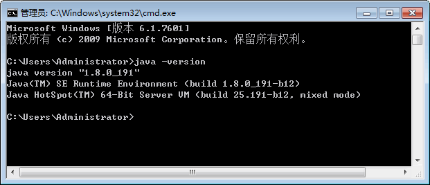
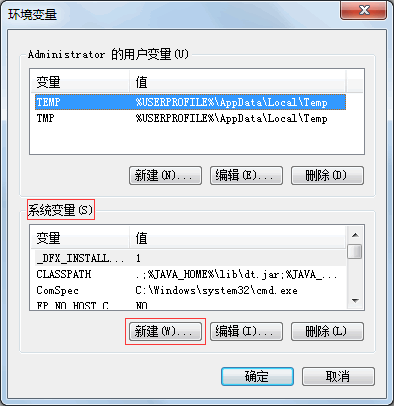
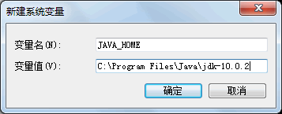

# JDK环境变量配置  | No.2

JDK 安装和配置完成后，可以测试其是否能够正常运行。

选择 “开始”|“运行” 命令，在打开的 “运行” 对话框中输入 cmd 命令，按 Enter 键进入到 DOS 环境下。

在命令提示符后输入并执行 java -version 命令，系统如果输出类似图 1 所示的 JDK 版本信息，说明 JDK 已经配置成功。

01查看JDK版本

提示：在命令提示符后输入测试命令时，需要注意 java 和减号之间有一个空格，而减号和 version 之间没有空格。

如果没有出现图 1 所示内容，说明 JDK 没有安装成功。

另外，一些java程序会通过环境变量搜索 JDK 的路径，使用压缩包安装 JDK 的方式也需要配置环境变量。

---

下面以`Windows 7` 系统为例，配置环境变量的具体步骤如下。

(1) 从桌面上右击 “计算机” 图标，从快捷菜单中选择 “属性” 命令，
在打开的 “系统属性” 对话框中单击 “环境变量” 按钮，如图 2 所示。

02“系统属性” 对话框

(2) 从弹出的 “环境变量” 对话框中单击 “系统变量” 列表框下方的 “新建” 按钮，如图 3 所示。

03“环境变量” 对话框

(3) 此时会弹出 “新建系统变量” 对话框。在 “变量名” 文本框中输入 JAVA_HOME，在 “变量值” 文本框中输入 JDK 的安装路径，图 4 所示。

最后单击 “确定” 按钮，保存 JAVA_HOME 变量。

04新建 JAVA_HOME 系统变量

(4) 在图 3 所示的 “系统变量” 列表框中双击 Path 变量，进入 “编辑系统变量” 对话框。在 “变量值” 文本框的最前端添加`.;％JAVA__HOME%\bin;`内容，如图 5 所示。最后单击 “确定” 按钮。

05 编辑 Path 系统变量

提示：字符串 “`.;％JAVA_HOME%\bin;`” 中的两个分号是不可缺少的，它们用于分隔多个环境变量。第一个分号前是一个英文状态半角下的句号，表示命令行下的当前目录；第二个分号前则是 JDK 的 bin 目录。

### 参考链接

1. http://c.biancheng.net/view/1290.html