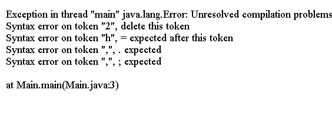

# Java 教程 - Java 关键字 | No.4

<br/>

#### 1.Java 中的关键字完整列表

关键词是其含义由编程语言定义的词。 Java 关键字和保留字：

```java
abstract class    extends implements null      strictfp     true
assert   const    false   import     package   super        try
boolean  continue final   instanceof private   switch       void
break    default  finally int        protected synchronized volatile
byte     do       float   interface  public    this         while
case     double   for     long       return    throw
catch    else     goto    native     short     throws
char     enum     if      new        static    transient
```

标识符是程序员用来命名变量，方法，类或标签的单词。
关键字和保留字不能用作标识符。

标识符必须以字母，美元符号（$）或下划线（_）开头;
后续字符可以是字母，美元符号，下划线或数字。
<br/>

一些例子是:

```java
foobar          // legal
Myclass         // legal
$a              // legal
3_a             // illegal: starts with a digit
!theValue       // illegal: bad 1st  char
```

Java 标识符区分大小写。例如，`myValue`和`MyValue`是不同的标识符。
<br/>

#### 2.使用标识符

标识符用于类名，方法名和变量名。
标识符可以是大写和小写字母，数字或下划线和美元符号字符的任何序列。
标识符不能以数字开头。Java 标识符区分大小写。

以下代码说明了有效标识符的一些示例：

```java
public class Main {
  public static void main(String[] argv) {
    int ATEST, count, i1, $Atest, this_is_a_test;
  }

}
```
<br/>

以下代码显示无效的变量名包括：

```java
public class Main {
  public static void main(String[] argv){
     int 2count, h-l, a/b,
  }
}
```

如果尝试编译此代码，您将收到以下错误消息：


图1:Java关键字编译错误⬆️

#### 参考链接

1. https://www.w3cschool.cn/java/java-keywords.html