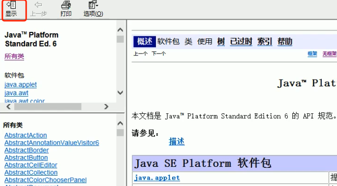
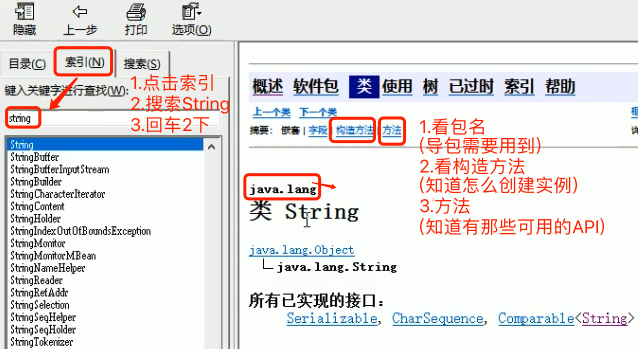
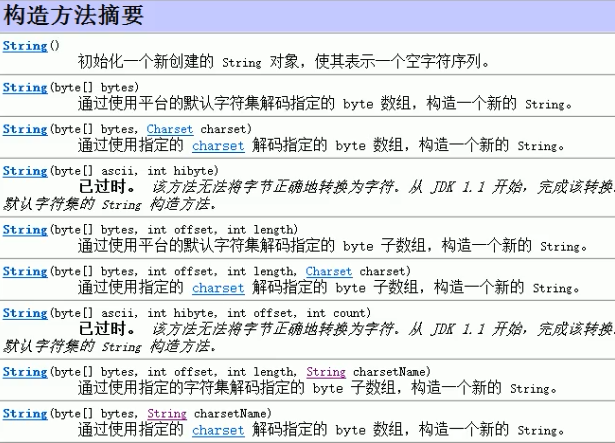
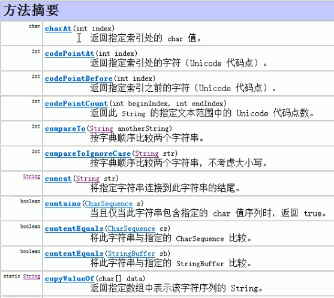

#  什么是 API？ 怎么查API？API 怎么用？

阅读编程资料时经常会看到 API 这个名词，网上各种高大上的解释估计放倒了一批初学者。

###  一、API 定义

如果不想看下面的天书，麻烦你记住这句人话：
> **API 就是不用管具体实现，被人封装好，直接可以用的工具类，直接调用即可实现对于功能。**

---

我们先来看看 API 的定义：

> API：应用程序接口（API：Application Program Interface）  
> 应用程序接口（API：application programming interface）是一组定义、程序及协议的集合，通过 API 接口实现计算机软件之间的相互通信。
> API 的一个主要功能是提供通用功能集。程序员通过使用 API 函数开发应用程序，从而可以避免编写无用程序，以减轻编程任务。

一个 API 接口的网络请求都有这些基本元素构成：

> API 接口大多数是由后端编写，前端开发人员进行请求调用

```
请求地址：URL
请求方式：POST | GET | ...
请求参数：Param
返回结果：resp
请求地址：URL
请求方式：POST | GET | ...
请求参数：Param
返回结果：resp
```

那么在开发中，接口是谁来定义，谁来使用，怎么用，需要什么条件？

我们不妨先举个生活中的例子：
> 假如咱们去一家餐馆吃饭
> 
> 来了位服务员
> 
> 帮助我们点完菜之后，她将菜单送到后厨
> 
> 吩咐下去，哪桌客人，点的什么菜，都有什么要求等等
> 
> 过了一会，菜做好了
> 
> 服务员又回到后厨，把菜端给我们；

在这个例子中：

服务员就是前端开发人员
厨师是后端
我们就是用户。

服务员将我们点的菜（请求参数）传至后厨（请求地址），
过了一端时间后，后厨说，菜做好了（返回结果），
然后服务员再去把菜端过来给我们吃，这就是一个网络请求的流程；

### 二、API怎么用？

#### 如何获取API 文档？

首先你要知道 API 有哪些，那么你需要有 API 文档？
文档从何而来？1. 官网，2.搜索引擎找

举例：

1. Java  8 API 官方在线地址：https://docs.oracle.com/javase/8/docs/api/
2. Java  8 API 官方下载地址：https://www.oracle.com/technetwork/java/javase/documentation/jdk8-doc-downloads-2133158.html
3. 网上的在线中文版：http://www.matools.com/api/java8
4. Java api 1.8 中文 帮助文档<sup>[3]</sup>
5. Sun公司官翻的Java 1.6 API文档<sup>[4]</sup>

#### API 文档怎么用？

**分3步**：

1. 查看包名
2. 查看构造方法
3. 查看成员方法

API文档一般都以是 `.CHM` 为文件后缀的，如 `JDK_API_1_6_zh_CN.CHM`。

那这种文件怎么打开呢？
也很简单，百度：`.CHM` 文件用什么打开？就有无数的答案。

`Windows` 本身支持打开 `.CHM`文件，无需安装任何其他软件。
`Mac` 自带软件不支持打开`.CHM`文件，或者会被认为是 压缩包。

`Mac` 推荐软件：1. `iCHM Pro`、2. `CHM Reader`
可能会遇到的乱码问题解决方案：
CHM Reader：依次打开   显示 ->文字编码 ->选择Unicode(UTF-8)
iCHM Pro：显示 -> 文本编码 -> UTF-8

此处演示的为：`JDK_API_1_6_zh_CN.CHM`<sup>[4]</sup>，此也使用此版本进行讲解。

拿我们用 Windows 举例带大家走一遍：

1. 打开 API 文档，点击`显示`



2. 点击`索引`，输入 `String`，回车2下，进入 `String` 的界面



3. 构造方法


4. 成员方法


Mac 下 用 `iCHM Pro` 打开如下：


了解了API的使用方式，我们通过Scanner类，熟悉一下查询API，并使用类的步骤。

### 三、实战

#### 3.1 什么是Scanner类
一个可以解析基本类型和字符串的简单文本扫描器。 
例如，以下代码使用户能够从 System.in 中读取一个数:

```java
Scanner sc = new Scanner(System.in); 
int i = sc.nextInt();
```
> 备注:System.in 系统输入指的是通过键盘录入数据。

#### 3.2 引用类型使用步骤

##### 导包

使用import关键字导包，在类的所有代码之前导包，引入要使用的类型，java.lang包下的所有类无需导入。 

格 式:
```java
import 包名.类名; 
```

举例:

```java
java.util.Scanner; 
```

##### 创建对象
使用该类的构造方法，创建一个该类的对象。 格式:

```java
数据类型 变量名 = new 数据类型(参数列表); 
```

举例:

```java
Scanner sc = new Scanner(System.in); 
```

##### 调用方法
调用该类的成员方法，完成指定功能。
格式:
```java
变量名.方法名(); 
```
举例:
```java
int i = sc.nextInt(); // 接收一个键盘录入的整数
```

#### 3.3 Scanner使用步骤

查看类
`java.util.Scanner :该类需要import导入后使用。`
查看构造方法
`public Scanner(InputStream source) : 构造一个新的 Scanner ，它生成的值是从指定的输入流扫描的。`
查看成员方法
`public int nextInt() :将输入信息的下一个标记扫描为一个 int 值`。
使用Scanner类，完成接收键盘录入数据的操作，代码如下:

```java
//1. 导包
import java.util.Scanner; 
public class Demo01_Scanner {
public static void main(String[] args) { //2. 创建键盘录入数据的对象
    Scanner sc = new Scanner(System.in);
    
    //3. 接收数据 System.out.println("请录入一个整数:");
    int i = sc.nextInt();
    
    //4. 输出数据
    System.out.println("i:"+i); }
}
```

大家可以去下面的参考链接多看看，自己也找几个类练习一下，明天带大家学习Object的API。

各位晚安~

#### 参考链接

[1] 新手上路：什么是 API 接口: http://t.cn/AiYgmDhs

[2] api （应用程序编程接口）: https://baike.baidu.com/item/api/10154

[3] Java api 1.8 中文 帮助文档: https://blog.fondme.cn/posts/21004/

[4] Sun公司官翻的Java 1.6 API文档 : https://pan.baidu.com/s/1nQBi9oT0ZXLMVzPg-Xbskw，密码:aqdg
