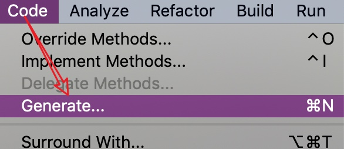
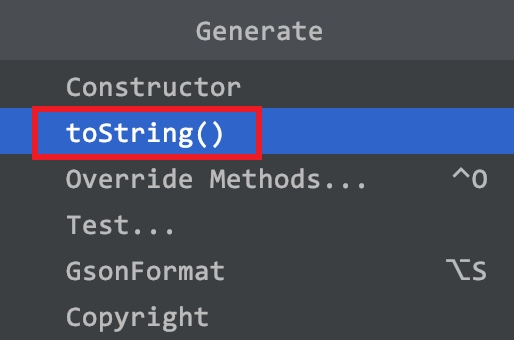
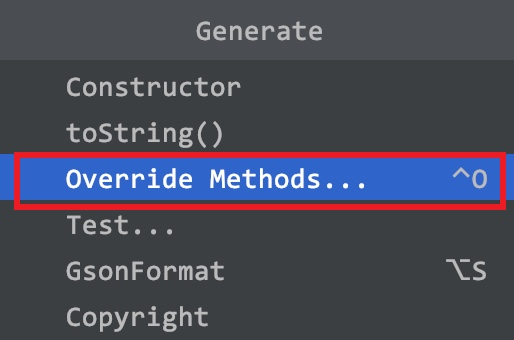
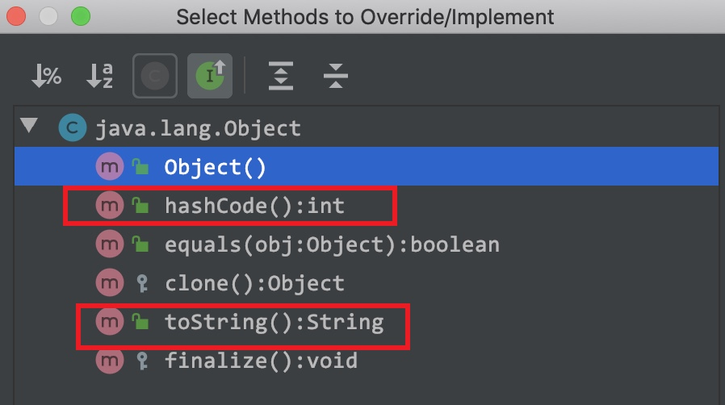

# Java Object API  | No.6

此文为 Java API 系列内容，此节整理 **Object  API** 的11个方法 。

本系列教程，均使用 ` IntelliJ IDEA ` 作为 默认 `IDE`  进行讲解。
文中出现的代码或者提供的外链，也请下载 ` IntelliJ IDEA ` 后打开；
使用`Eclipse`的朋友自理，新人也可先使用 `VS Code ` 作为文本编辑器。


> 注意：java的源代码文件后缀均为 `.java` 
> 有代码的文章，都不推荐手机阅读，觉得此文不错，建议电脑打开再阅读一遍，味道更佳~

**Java API  系列文章安排分为3部分**：

1. 类的概述 及 API 方法列表及释义
2. 给一个完整的实战 Demo
3. 解释每个方法用途和注意事项

##### 一、类的概述 及 API 方法列表及释义

`java.lang.Object`类是Java语言中的根类，即所有类的父类。
它描述的所有方法子类都可以使用。
在对象实例化的时候，最终找的父类就是Object。
如果一个类没有特别指定父类，那么默认则继承自Object类。

例如：

```java
public class MyClass /*extends Object*/ {
  	// ...
}
```

###### Object API 的11个方法


根据JDK源代码及Object类的API文档，Object类当中包含的方法有11个。

`public String toString()`：返回该对象的字符串形式。

`public boolean equals(Object obj)`：指示其他某个对象是否与此对象“相等”。

`protected Object	clone()` :创建并返回此对象的副本。

`protected void	finalize()` : 当垃圾收集确定没有对该对象的更多引用时，由对象上的垃圾收集器调用。

`Class<?>	getClass()` : 返回此 Object的运行时类。

`int	hashCode()` : 返回对象的哈希码值。

`void	notify() `: 唤醒正在此对象监视器上等待的单个线程。

`void	notifyAll()` : 唤醒等待此对象监视器的所有线程。

`void	wait()` : 导致当前线程等待，直到另一个线程为此对象调用 notify()方法或 notifyAll()方法。

`void	wait(long timeout) `: 导致当前线程等待，直到另一个线程为此对象调用 notify()方法或 notifyAll()方法，或者已经过了指定的时间量。

`void	wait(long timeout, int nanos) `: 导致当前线程等待，直到另一个线程为此对象调用 notify()方法或 notifyAll()方法，或者某个其他线程中断当前线程，或者已经过了一定量的实时。

##### 二、完整的实战 Demo

先贴一个会常用到的3个方法实例 Demo，然后再往下看具体含义及注意事项。
可直接copy 到 IDE 执行测试，也可以点击文末提供的源代码地址进行下载。

```java
package com.dragon.demo.object;

import java.util.ArrayList;
import java.util.Objects;
import java.util.Random;
import java.util.Scanner;

/**
 * @author dragon
 * @version V0.1
 * @title: com.md.demo.object.ObjectApiDemo
 * @description: Java语言中的根类：Object的 API Demo
 * @document: https://docs.oracle.com/javase/8/docs/api/
 * @date 2019/08/06 22:58
 */
public class ObjectApiDemo {

  /**
   * 为方便大家直接运行代码，前期都使用 main 方法的形式写demo
   */
  public static void main(String[] args) {

    /*
     java.lang.Object
     类 Object 是类层次结构的根(父)类。
     每个类(Person,Student...)都使用 Object 作为超(父)类。
     所有对象（包括数组）都实现这个类的方法。

     今天主要学习Object的三个方法：
     1.toString ()
     2.equals (Object obj)
     3.hashCode()
     */
    Object object = new Object();

    //1.=====================================
    //public String toString ()：返回该对象的字符串形式。
    String toString = object.toString();
    // toString: java.lang.Object@60e53b93
    System.out.println("Object.toString : " + toString);

    /*
      Person类默认继承了Object类,所以可以使用Object类中的toString方法
      String toString() 返回该对象的字符串表示。
    */
    Person p = new Person("dragon", 18);
    //com.md.demo.object.Person@75412c2f | abc | Person{name=张三 ,age=18}
    System.out.println("Person.toString : " + p.toString());

    /*
      直接打印对象的名字,其实就是调用对象的 toString  p=p.toString();
      com.md.demo.object.Person@5f150435 | abc | Person{name=张三 ,age=18}
     */
    System.out.println(p);

    //看一个类是否重写了toString,直接打印这个类的对象即可,如果没有重写toString方法那么打印的是对象的地址值
    Random r = new Random();
    //java.util.Random@3f3afe78  没有重写toString方法
    System.out.println(r);

    Scanner sc = new Scanner(System.in);
    //java.util.Scanner[delimiters=\p{javaWhitespace}+..  重写toString方法
    System.out.println(sc);

    ArrayList<Integer> list = new ArrayList<>();
    list.add(1);
    list.add(2);
    list.add(3);
    //[1, 2, 3]  重写toString方法
    System.out.println(list);


    //2.=====================================
    //public boolean equals (Object obj)：指示其他某个对象是否与此对象“相等”。
    Object tempObject = new Object();
    boolean equalsResult = object.equals(tempObject);
    System.out.println("equals : " + equalsResult);

     /*
        Person类默认继承了Object类,所以可以使用Object类的equals方法
        boolean equals(Object obj) 指示其他某个对象是否与此对象“相等”。
        equals方法源码:
            public boolean equals(Object obj) {
                return (this == obj);
            }
          参数:
              Object obj:可以传递任意的对象
              == 比较运算符,返回的是一个布尔值 true false
              基本数据类型:比较的是值
              引用数据类型:比价的是两个对象的地址值

           this是谁? 哪个对象调用的方法,方法中的this就是哪个对象;
           p1调用的equals方法所以this就是p1
           obj是谁? 传递过来的参数p2
           this==obj --> p1 == p2
   */
    Person p1 = new Person("dragon", 18);
    //Person p2 = new Person("mr-dragon",19);
    Person p2 = new Person("dragon", 18);
    System.out.println("p1:" + p1);//p1:com.md.demo.object.Object.Person@58ceff1
    System.out.println("p2:" + p2);//p2:com.md.demo.object.Object.Person@7c30a502

    System.out.println("p1.equals(p1): "+ p1.equals(p1));
    System.out.println("p1.equals(p2): "+ p1.equals(p2));

    //3.=====================================
    //int hashCode () :返回对象的哈希码值。
    int hashCode = object.hashCode();
    System.out.println("hashCode = " + hashCode);

    //============= Objects  ===============
    String s1 = "abc";
    //String s1 = null;
    String s2 = "abc";
    //boolean b = s1.equals(s2); // NullPointerException null是不能调用方法的,会抛出空指针异常
    //System.out.println(b);
    /*
        Objects类的equals方法: 对两个对象进行比较,防止空指针异常
        public static boolean equals(Object a, Object b) {
            return (a == b) || (a != null && a.equals(b));
        }
     */
    System.out.println("Objects.equals(s1, s2)："+ Objects.equals(s1, s2));

  }
}
```

##### 三、解释每个方法用途和注意事项

###### 1. toString 方法

`public String toString()`：返回对象的字符串表示形式。其实该字符串内容就是**对象的类型+@+内存地址值**。

由于toString方法返回的结果是内存地址，而在开发中，经常需要按照对象的属性得到相应的字符串表现形式，因此建议所有子类都覆盖此方法。

 ```java
 getClass().getName() + '@' + Integer.toHexString(hashCode())
 ```

###### 覆盖重写

如果不希望使用toString方法的默认行为，则可以对它进行覆盖重写。

例如自定义的Person类：

```java
public class Person {  
    private String name;
    private int age;

   /*
        直接打印对象的地址值没有意义,需要重写Object类中的toString方法
        打印对象的属性(name,age)
     */
    @Override
    public String toString() {
       return "Person{name="+name+" ,age="+age+"}";
    }

    // 省略构造器与Getter Setter
}
```

在 `IntelliJ IDEA` 中，可以点击`Code`菜单中的`Generate...`，也可以使用快捷键`alt + insert`( Windows ) / `⌘ + N `( Mac )，点击`toString()`选项。选择需要包含的成员变量并确定。

如下图所示(Mac下演示)：





###### 注意事项

问题: 这种方法隐含着一个多态的弊端-->无法使用子类特有的内容(属性和方法)

```java
@Override
public boolean equals(Object obj) {
    //增加一个判断,传递的参数obj如果是this本身,直接返回true,提高程序的效率
    if(obj==this){
        return true;
    }

    //增加一个判断,传递的参数obj如果是null,直接返回false,提高程序的效率
    if(obj==null){
        return false;
    }

    //增加一个判断,防止类型转换一次ClassCastException
    if(obj instanceof Person){
        //使用向下转型,把obj转换为Person类型
        Person p = (Person)obj;
        //比较两个对象的属性,一个对象是this(p1),一个对象是p(obj->p2)
        boolean b = this.name.equals(p.name) && this.age==p.age;
        return b;
    }
    //不是Person类型直接返回false
    return false;
}
```

解决:可以使用向下转型(强转)把obj类型转换为Person

> 小贴士：直接使用输出语句输出对象名的时候,其实通过该对象调用了其toString()方法。


##### 2. equals方法

###### 方法摘要

`public boolean equals(Object obj)`：指示其他某个对象是否与此对象“相等”。

调用成员方法equals并指定参数为另一个对象，则可以判断这两个对象是否是相同的。这里的“相同”有默认和自定义两种方式。

###### 默认地址比较

如果没有覆盖重写equals方法，那么Object类中默认进行`==`运算符的对象地址比较，只要不是同一个对象，结果必然为false。

###### 对象内容比较

如果希望进行对象的内容比较，即所有或指定的部分成员变量相同就判定两个对象相同，则可以覆盖重写equals方法。

例如：
```java
import java.util.Objects;
public class Person {	
  private String name;
  private int age;
  @Override
  public boolean equals(Object o) {
      // 如果对象地址一样，则认为相同
      if (this == o)
          return true;
      // 如果参数为空，或者类型信息不一样，则认为不同
      if (o == null || getClass() != o.getClass())
          return false;
      // 转换为当前类型
      Person person = (Person) o;
      // 要求基本类型相等，并且将引用类型交给java.util.Objects类的equals静态方法取用结果
      return age == person.age && Objects.equals(name, person.name);
  }
}
```
这段代码充分考虑了对象为空、类型一致等问题，但方法内容并不唯一。

大多数IDE都可以自动生成equals方法的代码内容。
在IntelliJ IDEA中，可以使用`Code`菜单中的`Generate…`选项，也可以使用快捷键`alt + insert`( Windows ) / `⌘ + N `( Mac )，并选择`Override Methods`,在弹出的窗口选择要重写的方法进行自动代码生成，可多选。

如图所示：






#### 三、Objects 类

上面重写equals代码中，使用到了`java.util.Objects`类，那么这个类是什么呢？

在`JDK 1.7`添加了一个Objects工具类，它提供了一些方法来操作对象，它由一些静态的实用方法组成，这些方法是 null-save（空指针安全的）或 null-tolerant（容忍空指针的），用于计算对象的 hashcode 、返回对象的字符串表示形式、比较两个对象。

在比较两个对象的时候，Object 的 equals 方法容易抛出空指针异常，而 Objects类中的equals方法就优化了这个问题。

方法如下：

`public static boolean equals(Object a, Object b)`:判断两个对象是否相等。

如果这两个参数是null， 返回true，如果只有一个参数是null，返回false。
否则，通过使用第一个参数的equals方法确定相等性。

参数
a ： 一个对象
b ：要与 a进行比较以进行相等的对象

结果: 如果参数彼此相等返回true，否则false。

我们可以查看一下源码，学习一下：

```java
public static boolean equals(Object a, Object b) {  
    return (a == b) || (a != null && a.equals(b));  
}
```


#### 今日总结

1. Object 类的概述 及 API 方法列表及释义
2. 对3个常用方法进行实操，指出一些会遇到的问题
3. IDEA 如何重写类的方法


#### References

1. [本文代码地址&API文档下载地址](https://github.com/mr-dragon/java-basic-demo)
2. [Java系列IT技术教程汇总](http://mp.weixin.qq.com/mp/homepage?__biz=MzAwMTE2MzA1Mg==&hid=3)
3. [IntelliJ IDEA 简体中文专题教程](https://github.com/judasn/IntelliJ-IDEA-Tutorial)
4. [VS Code 基础教程](https://mp.weixin.qq.com/s/E2uhf2a6TAPHTxltkq-9hw)