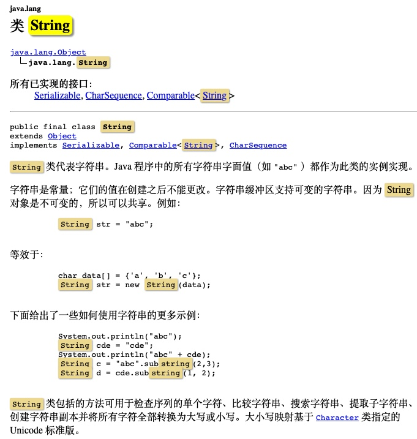
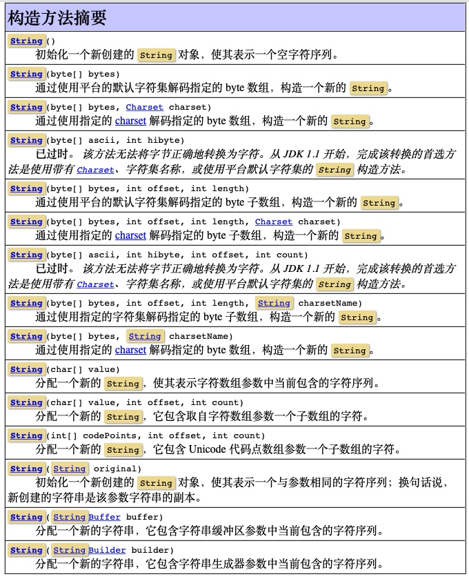
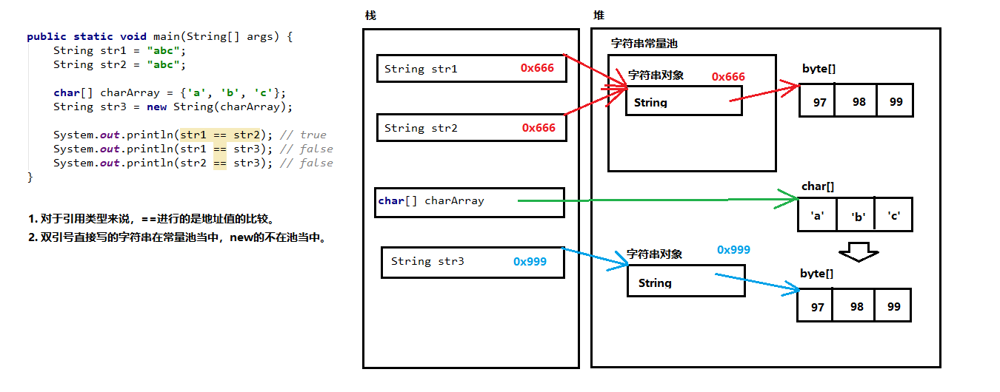
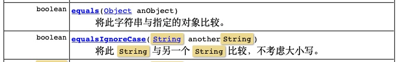

#### Java String API | 010

此文为 Java API 系列内容，此节整理 **String  API** 中的常用API 。

本系列教程，均使用 ` IntelliJ IDEA ` 作为 默认 `IDE`  进行讲解。
文中出现的代码或者提供的外链，也请下载 ` IntelliJ IDEA ` 后打开；
使用`Eclipse`的朋友自理，新人也可先使用 `VS Code ` 作为文本编辑器。


> 注意：java 的源代码文件后缀均为 `.java` 
> 有代码的文章，都不推荐手机阅读，觉得此文不错，建议电脑打开再阅读一遍，味道更佳~

**Java API  系列文章安排分为3部分**：

1. 类的概述 及 API 方法列表及释义
2. 给一个完整的实战 Demo
3. 解释每个方法用途和注意事项

#### 一、String类



`java.lang.String` 类代表字符串。

Java 程序中的所有字符串字面值（如 "abc" ）都作为此类的实例实现。
其实就是说：程序当中所有的双引号字符串，都是String类的对象。（就算没有new，也照样是。）

字符串是常量；它们的值在创建之后不能更改。字符串缓冲区支持可变的字符串。因为 String 对象是不可变的，所以可以共享。

字符串的特点：
1. 字符串的内容永不可变。【重点】
2. 正是因为字符串不可改变，所以字符串是可以共享使用的。
3. 字符串效果上相当于是char[]字符数组，但是底层原理是byte[]字节数组。

##### 构造方法



<br />

创建字符串的常见3+1种方式。
三种构造方法：
`public String()`：创建一个空白字符串，不含有任何内容。

`public String(char[] array)`：根据字符数组的内容，来创建对应的字符串。

`public String(byte[] array)`：根据字节数组的内容，来创建对应的字符串。
还有一种直接创建：

```java
String str = "Hello"; // 右边直接用双引号
```

> 注意：直接写上双引号，就是字符串对象。

这3+1种创建方式的代码如下：

```java
// 1.使用空参构造
String str1 = new String(); // 小括号留空，说明字符串什么内容都没有。IDEA 会提示这种做法是多余的。
System.out.println("第1个字符串：" + str1);

// 2.根据字符数组创建字符串
char[] charArray = {'A', 'B', 'C'};
String str2 = new String(charArray);
System.out.println("第2个字符串：" + str2);

// 3.根据字节数组创建字符串
byte[] byteArray = {97, 98, 99};
String str3 = new String(byteArray);
System.out.println("第3个字符串：" + str3);

// 4.直接创建
String str4 = "Hello";
System.out.println("第4个字符串：" + str4);
/*
第1个字符串：
第2个字符串：ABC
第3个字符串：abc
第4个字符串：Hello
*/
```

##### 字符串常量池

字符串常量池：程序当中直接写上的双引号字符串，就在字符串常量池中。



对于基本类型来说，`== `是进行 `数值 `的比较。
对于引用类型来说，   是进行【`地址值`】的比较。

```java
String string1 = "abc";
String string2 = "abc";

char[] charArray2 = {'a', 'b', 'c'};
String string3 = new String(charArray);

System.out.println(string1 == string2); // true
System.out.println(string1 == string3); // false
System.out.println(string2 == string3); // false
```
<br/>

#### 二、String 的 API

主要有5小节，代码较多，慢慢品尝~

1. 比较
2. 获取
3. 截取
4. 转换/替换
5. 分割

首先说下`String`的比较有哪些方式。

##### 1. 比较

`==`是进行对象的地址值比较，如果确实需要字符串的内容比较，可以使用两个方法：




`public boolean equals(Object obj)`：参数可以是任何对象，只有参数是一个字符串并且内容相同的才会给true；否则返回false。

注意事项：
1. 任何对象都能用 Object 进行接收。
2. equals方法具有对称性，也就是 a.equals(b) 和 b.equals(a) 效果一样。
3. 如果比较双方一个常量一个变量，推荐把常量字符串写在前面。


推荐：`"abc".equals(str)`
不推荐：`str.equals("abc")`


`public boolean equalsIgnoreCase(String str)`：忽略大小写，进行内容比较。


```java
String str1 = "Hello";
String str2 = "Hello";
char[] charArray3 = {'H', 'e', 'l', 'l', 'o'};
String str3 = new String(charArray3);

System.out.println(str1.equals(str2)); // true
System.out.println(str2.equals(str3)); // true
System.out.println(str3.equals("Hello")); // true
System.out.println("Hello".equals(str1)); // true

String str4 = "hello";
System.out.println(str1.equals(str4)); // false
System.out.println("=================");

String str5 = null;
System.out.println("abc".equals(str5)); // 推荐：false
// System.out.println(str5.equals("abc")); // 不推荐：报错，空指针异常NullPointerException
System.out.println("=================");

String strA = "Java";
String strB = "java";
System.out.println(strA.equals(strB)); // false，严格区分大小写
System.out.println(strA.equalsIgnoreCase(strB)); // true，忽略大小写

// 注意，只有英文字母区分大小写，其他都不区分大小写
System.out.println("abc一123".equalsIgnoreCase("abc壹123")); // false

```

<br />

##### 2. 获取

`String` 当中与获取相关的常用方法有：

`public int length()`：获取字符串当中含有的字符个数，拿到字符串长度。

`public String concat(String str)`：将当前字符串和参数字符串拼接成为返回值新的字符串。

`public char charAt(int index)`：获取指定索引位置的单个字符。（索引从0开始。）

`public int indexOf(String str)`：查找参数字符串在本字符串当中首次出现的索引位置，如果没有返回-1值。
  

```java
// 获取字符串的长度
int length = "dragon".length();
System.out.println("字符串的长度是：" + length);

// 拼接字符串
String str1 = "Hello";
String str2 = "World";
String str3 = str1.concat(str2); // str1 + str2
System.out.println(str1); // Hello，原封不动
System.out.println(str2); // World，原封不动
System.out.println(str3); // HelloWorld，新的字符串
System.out.println("==============");

// 获取指定索引位置的单个字符
char ch = "Hello".charAt(1);
System.out.println("在1号索引位置的字符是：" + ch);
System.out.println("==============");

// 查找参数字符串在本来字符串当中出现的第一次索引位置
// 如果根本没有，返回-1值
String original = "HelloWorldHelloWorld";
int index = original.indexOf("llo");
System.out.println("第一次索引值是：" + index); // 2

System.out.println("HelloWorld".indexOf("abc")); // -1
```

<br />

##### 3. 截取

字符串的截取方法：
`public String substring(int index)`：截取从参数位置一直到字符串末尾，返回新字符串。

`public String substring(int begin, int end)`：截取从begin开始，一直到end结束，中间的字符串。

> 备注：[begin,end)，包含左边，不包含右边。

```java
String str1 = "HelloWorld";
String str2 = str1.substring(5);
System.out.println(str1); // HelloWorld，原封不动
System.out.println(str2); // World，新字符串
System.out.println("================");

String str3 = str1.substring(4, 7);
System.out.println(str3); // oWo
System.out.println("================");

// 下面这种写法，字符串的内容仍然是没有改变的
// 下面有两个字符串："Hello"，"Java"
// strA当中保存的是地址值。
// 本来地址值是Hello的0x666，
// 后来地址值变成了Java的0x999
String strA = "Hello";
System.out.println(strA); // Hello
String strA = "Java";
System.out.println(strA); // Java
```

<br />

##### 4. 转换/替换

String当中与转换相关的常用方法有：

`public char[] toCharArray()`：将当前字符串拆分成为字符数组作为返回值。

`public byte[] getBytes()`：获得当前字符串底层的字节数组。

`public String replace(CharSequence oldString, CharSequence newString)`：
将所有出现的老字符串替换成为新的字符串，返回替换之后的结果新字符串。

> 备注：CharSequence 意思就是说可以接受字符串类型。

```java
 // 转换成为字符数组
char[] chars = "Hello".toCharArray();
System.out.println(chars[0]); // H
System.out.println(chars.length); // 5
System.out.println("==============");

// 转换成为字节数组
byte[] bytes = "abc".getBytes();
for (int i = 0; i < bytes.length; i++) {
  System.out.println(bytes[i]);
}
System.out.println("==============");

// 字符串的内容替换
str1 = "How do you do?";
str2 = str1.replace("o", "*");
System.out.println(str1); // How do you do?
System.out.println(str2); // H*w d* y*u d*?
System.out.println("==============");

String lang1 = "会不会玩儿呀！你大爷的！你大爷的！你大爷的！！！";
String lang2 = lang1.replace("你大爷的", "****");
System.out.println(lang2); // 会不会玩儿呀！****！****！****！！！
```

<br />

##### 5. 分割

分割字符串的方法：
`public String[] split(String regex)`：按照参数的规则，将字符串切分成为若干部分。

注意事项：
split方法的参数其实是一个“正则表达式”，今后学习。
今天要注意：如果按照英文句点“.”进行切分，必须写"\\."（两个反斜杠）

```java
String str1 = "aaa,bbb,ccc";
String[] array1 = str1.split(",");
for (int i = 0; i < array1.length; i++) {
  System.out.println(array1[i]);
}
System.out.println("===============");

String str2 = "aaa bbb ccc";
String[] array2 = str2.split(" ");
for (int i = 0; i < array2.length; i++) {
  System.out.println(array2[i]);
}
System.out.println("===============");

String str3 = "XXX.YYY.ZZZ";
String[] array3 = str3.split("\\.");
System.out.println(array3.length); // 0
for (int i = 0; i < array3.length; i++) {
  System.out.println(array3[i]);
}

```

<br />

#### 三、练习题

上面学习这么多API，是不是敲一遍就会了呢？ 想真正融会贯通，得练习，结合实际需求去做。
下面给大家2道练习题。

##### 题目一

定义一个方法，把数组{1,2,3}按照指定格式拼接成一个字符串。格式参照如下：[word1#word2#word3]。

分析：
1. 首先准备一个int[]数组，内容是：1、2、3
2. 定义一个方法，用来将数组变成字符串

三要素
返回值类型：String
方法名称：fromArrayToString
参数列表：int[]
3. 格式：[word1#word2#word3]
用到：for循环、字符串拼接、每个数组元素之前都有一个word字样、分隔使用的是#、区分一下是不是最后一个
4. 调用方法，得到返回值，并打印结果字符串

<br/>

```java

int[] array = {1, 2, 3, 4};

String result = fromArrayToString(array);
System.out.println(result);

/**
* 数组 转 字符串
* @param array 数组
* @return
*/
public static String fromArrayToString(int[] array) {
String str = "[";
for (int i = 0; i < array.length; i++) {
  if (i == array.length - 1) {
    str += "word" + array[i] + "]";
  } else {
    str += "word" + array[i] + "#";
  }
}
return str;
}
```

<br />

##### 题目二

键盘输入一个字符串，并且统计其中各种字符出现的次数。
种类有：大写字母、小写字母、数字、其他

思路：
1. 既然用到键盘输入，肯定是 `Scanner`
2. 键盘输入的是字符串，那么：`String str = sc.next();`
3. 定义四个变量，分别代表四种字符各自的出现次数。
   4. 需要对字符串一个字、一个字检查，`String-->char[]`，方法就是`toCharArray()`
5. 遍历char[]字符数组，对当前字符的种类进行判断，并且用四个变量进行`++`动作。
6. 打印输出四个变量，分别代表四种字符出现次数。

<br/>

```java
Scanner sc = new Scanner(System.in);
System.out.println("请输入一个字符串：");
String input = sc.next(); // 获取键盘输入的一个字符串

int countUpper = 0; // 大写字母
int countLower = 0; // 小写字母
int countNumber = 0; // 数字
int countOther = 0; // 其他字符

charArray = input.toCharArray();
for (int i = 0; i < charArray.length; i++) {
  char char2 = charArray[i]; // 当前单个字符
  if ('A' <= char2 && char2 <= 'Z') {
    countUpper++;
  } else if ('a' <= char2 && char2 <= 'z') {
    countLower++;
  } else if ('0' <= char2 && char2 <= '9') {
    countNumber++;
  } else {
    countOther++;
  }
}

System.out.println("大写字母有：" + countUpper);
System.out.println("小写字母有：" + countLower);
System.out.println("数字有：" + countNumber);
System.out.println("其他字符有：" + countOther);

```

以上为今天的全部内容，再给大家贴一份完整代码，也可从文末的地址里面下载查看。


本文完整代码：

```java
package com.dragon.demo5.string;

import java.util.Scanner;

/**
 * @author dragon
 * @version V0.1
 * @title: com.dragon.demo5.string.StringApiDemo
 * @description: Java语言中的 字符串类：String 的 API Demo
 * @document: https://docs.oracle.com/javase/8/docs/api/
 * @date 2019/08/12
 */
public class StringApiDemo {

  /**
   * 为方便大家直接运行代码，前期都使用 main 方法的形式写demo
   */
  public static void main(String[] args) {
    /*
      java.lang.String类代表字符串。
      API当中说：Java 程序中的所有字符串字面值（如 "abc" ）都作为此类的实例实现。
      其实就是说：程序当中所有的双引号字符串，都是String类的对象。（就算没有new，也照样是。）

      字符串的特点：
      1. 字符串的内容永不可变。【重点】
      2. 正是因为字符串不可改变，所以字符串是可以共享使用的。
      3. 字符串效果上相当于是char[]字符数组，但是底层原理是byte[]字节数组。

      创建字符串的常见3+1种方式。
      三种构造方法：
      public String()：创建一个空白字符串，不含有任何内容。
      public String(char[] array)：根据字符数组的内容，来创建对应的字符串。
      public String(byte[] array)：根据字节数组的内容，来创建对应的字符串。
      还有一种直接创建：
      String str = "Hello"; // 右边直接用双引号

      注意：直接写上双引号，就是字符串对象。
    */

    // 1.使用空参构造
    String str1 = new String(); // 小括号留空，说明字符串什么内容都没有。IDEA 会提示这种做法是多余的。
    System.out.println("第1个字符串：" + str1);

    // 2.根据字符数组创建字符串
    char[] charArray = {'A', 'B', 'C'};
    String str2 = new String(charArray);
    System.out.println("第2个字符串：" + str2);

    // 3.根据字节数组创建字符串
    byte[] byteArray = {97, 98, 99};
    String str3 = new String(byteArray);
    System.out.println("第3个字符串：" + str3);

    // 4.直接创建
    String str4 = "Hello";
    System.out.println("第4个字符串：" + str4);
    /*
    第1个字符串：
    第2个字符串：ABC
    第3个字符串：abc
    第4个字符串：Hello
     */


    //  =========常量池=========
    /*
    字符串常量池：程序当中直接写上的双引号字符串，就在字符串常量池中。

    对于基本类型来说，== 是进行 数值 的比较。
    对于引用类型来说，== 是进行【地址值】的比较。
 */
    String string1 = "abc";
    String string2 = "abc";

    char[] charArray2 = {'a', 'b', 'c'};
    String string3 = new String(charArray);

    System.out.println(string1 == string2); // true
    System.out.println(string1 == string3); // false
    System.out.println(string2 == string3); // false


    //  ========= API Demo =========start

    //  ========= 1. 比较 Demo =========start
    /*
      ==是进行对象的地址值比较，如果确实需要字符串的内容比较，可以使用两个方法：

      public boolean equals(Object obj)：参数可以是任何对象，只有参数是一个字符串并且内容相同的才会给true；否则返回false。
      注意事项：
      1. 任何对象都能用Object进行接收。
      2. equals方法具有对称性，也就是a.equals(b)和b.equals(a)效果一样。
      3. 如果比较双方一个常量一个变量，推荐把常量字符串写在前面。
      推荐："abc".equals(str)    不推荐：str.equals("abc")

      public boolean equalsIgnoreCase(String str)：忽略大小写，进行内容比较。
    */

    str1 = "Hello";
    str2 = "Hello";
    char[] charArray3 = {'H', 'e', 'l', 'l', 'o'};
    str3 = new String(charArray3);

    System.out.println(str1.equals(str2)); // true
    System.out.println(str2.equals(str3)); // true
    System.out.println(str3.equals("Hello")); // true
    System.out.println("Hello".equals(str1)); // true

    str4 = "hello";
    System.out.println(str1.equals(str4)); // false
    System.out.println("=================");

    String str5 = null;
    System.out.println("abc".equals(str5)); // 推荐：false
    // System.out.println(str5.equals("abc")); // 不推荐：报错，空指针异常NullPointerException
    System.out.println("=================");

    String strA = "Java";
    String strB = "java";
    System.out.println(strA.equals(strB)); // false，严格区分大小写
    System.out.println(strA.equalsIgnoreCase(strB)); // true，忽略大小写

    // 注意，只有英文字母区分大小写，其他都不区分大小写
    System.out.println("abc一123".equalsIgnoreCase("abc壹123")); // false

    //  ========= 1. 比较 Demo =========end


    //  ========= 2. 获取 Demo =========start
    /*
    String当中与获取相关的常用方法有：

    public int length()：获取字符串当中含有的字符个数，拿到字符串长度。
    public String concat(String str)：将当前字符串和参数字符串拼接成为返回值新的字符串。
    public char charAt(int index)：获取指定索引位置的单个字符。（索引从0开始。）
    public int indexOf(String str)：查找参数字符串在本字符串当中首次出现的索引位置，如果没有返回-1值。
     */

    // 获取字符串的长度
    int length = "dragon".length();
    System.out.println("字符串的长度是：" + length);

    // 拼接字符串
    str1 = "Hello";
    str2 = "World";
    str3 = str1.concat(str2); // str1 + str2
    System.out.println(str1); // Hello，原封不动
    System.out.println(str2); // World，原封不动
    System.out.println(str3); // HelloWorld，新的字符串
    System.out.println("==============");

    // 获取指定索引位置的单个字符
    char ch = "Hello".charAt(1);
    System.out.println("在1号索引位置的字符是：" + ch);
    System.out.println("==============");

    // 查找参数字符串在本来字符串当中出现的第一次索引位置
    // 如果根本没有，返回-1值
    String original = "HelloWorldHelloWorld";
    int index = original.indexOf("llo");
    System.out.println("第一次索引值是：" + index); // 2

    System.out.println("HelloWorld".indexOf("abc")); // -1

    //  ========= 2. 获取 Demo =========end

    //  ========= 3. 截取 Demo =========start
    /*
      字符串的截取方法：
      public String substring(int index)：截取从参数位置一直到字符串末尾，返回新字符串。
      public String substring(int begin, int end)：截取从 [begin,end)，之间的字符串，不包含end位置的字符。
      备注：[begin,end)，包含左边，不包含右边。
   */
    str1 = "HelloWorld";
    str2 = str1.substring(5);
    System.out.println(str1); // HelloWorld，原封不动
    System.out.println(str2); // World，新字符串
    System.out.println("================");

    str3 = str1.substring(4, 7);
    System.out.println(str3); // oWo
    System.out.println("================");

    // 下面这种写法，字符串的内容仍然是没有改变的
    // 下面有两个字符串："Hello"，"Java"
    // strA当中保存的是地址值。
    // 本来地址值是Hello的0x666，
    // 后来地址值变成了Java的0x999
    strA = "Hello";
    System.out.println(strA); // Hello
    strA = "Java";
    System.out.println(strA); // Java

    //  ========= 3. 截取 Demo =========end

    //  ========= 4. 转换/替换 Demo =========start
    /*
      String当中与转换相关的常用方法有：

      public char[] toCharArray()：将当前字符串拆分成为字符数组作为返回值。
      public byte[] getBytes()：获得当前字符串底层的字节数组。
      public String replace(CharSequence oldString, CharSequence newString)：
      将所有出现的老字符串替换成为新的字符串，返回替换之后的结果新字符串。
      备注：CharSequence意思就是说可以接受字符串类型。
 */
    // 转换成为字符数组
    char[] chars = "Hello".toCharArray();
    System.out.println(chars[0]); // H
    System.out.println(chars.length); // 5
    System.out.println("==============");

    // 转换成为字节数组
    byte[] bytes = "abc".getBytes();
    for (int i = 0; i < bytes.length; i++) {
      System.out.println(bytes[i]);
    }
    System.out.println("==============");

    // 字符串的内容替换
    str1 = "How do you do?";
    str2 = str1.replace("o", "*");
    System.out.println(str1); // How do you do?
    System.out.println(str2); // H*w d* y*u d*?
    System.out.println("==============");

    String lang1 = "会不会玩儿呀！你大爷的！你大爷的！你大爷的！！！";
    String lang2 = lang1.replace("你大爷的", "****");
    System.out.println(lang2); // 会不会玩儿呀！****！****！****！！！
    //  ========= 4. 转换/替换 Demo =========end

    //  ========= 5. 分割 Demo =========start
    /*
      分割字符串的方法：
      public String[] split(String regex)：按照参数的规则，将字符串切分成为若干部分。

      注意事项：
      split方法的参数其实是一个“正则表达式”，今后学习。
      今天要注意：如果按照英文句点“.”进行切分，必须写"\\."（两个反斜杠）
     */
    //  ========= 5. 分割 Demo =========end
    str1 = "aaa,bbb,ccc";
    String[] array1 = str1.split(",");
    for (int i = 0; i < array1.length; i++) {
      System.out.println(array1[i]);
    }
    System.out.println("===============");

    str2 = "aaa bbb ccc";
    String[] array2 = str2.split(" ");
    for (int i = 0; i < array2.length; i++) {
      System.out.println(array2[i]);
    }
    System.out.println("===============");

    str3 = "XXX.YYY.ZZZ";
    String[] array3 = str3.split("\\.");
    System.out.println(array3.length); // 0
    for (int i = 0; i < array3.length; i++) {
      System.out.println(array3[i]);
    }

    //  ========= API Demo =========end


    //  ========= 题目1 =========start
    /*
      定义一个方法，把数组{1,2,3}按照指定格式拼接成一个字符串。格式参照如下：[word1#word2#word3]。

      分析：
      1. 首先准备一个int[]数组，内容是：1、2、3
      2. 定义一个方法，用来将数组变成字符串
      三要素
      返回值类型：String
      方法名称：fromArrayToString
      参数列表：int[]
      3. 格式：[word1#word2#word3]
      用到：for循环、字符串拼接、每个数组元素之前都有一个word字样、分隔使用的是#、区分一下是不是最后一个
      4. 调用方法，得到返回值，并打印结果字符串
    */
    int[] array = {1, 2, 3, 4};

    String result = fromArrayToString(array);
    System.out.println(result);
    //  ========= 题目1 =========end

    //  ========= 题目2 =========start
    /*
      键盘输入一个字符串，并且统计其中各种字符出现的次数。
      种类有：大写字母、小写字母、数字、其他

      思路：
      1. 既然用到键盘输入，肯定是Scanner
      2. 键盘输入的是字符串，那么：String str = sc.next();
      3. 定义四个变量，分别代表四种字符各自的出现次数。
      4. 需要对字符串一个字、一个字检查，String-->char[]，方法就是toCharArray()
      5. 遍历char[]字符数组，对当前字符的种类进行判断，并且用四个变量进行++动作。
      6. 打印输出四个变量，分别代表四种字符出现次数。
    */

    Scanner sc = new Scanner(System.in);
    System.out.println("请输入一个字符串：");
    String input = sc.next(); // 获取键盘输入的一个字符串

    int countUpper = 0; // 大写字母
    int countLower = 0; // 小写字母
    int countNumber = 0; // 数字
    int countOther = 0; // 其他字符

    charArray = input.toCharArray();
    for (int i = 0; i < charArray.length; i++) {
      char char2 = charArray[i]; // 当前单个字符
      if ('A' <= char2 && char2 <= 'Z') {
        countUpper++;
      } else if ('a' <= char2 && char2 <= 'z') {
        countLower++;
      } else if ('0' <= char2 && char2 <= '9') {
        countNumber++;
      } else {
        countOther++;
      }
    }

    System.out.println("大写字母有：" + countUpper);
    System.out.println("小写字母有：" + countLower);
    System.out.println("数字有：" + countNumber);
    System.out.println("其他字符有：" + countOther);

    //  ========= 题目2 =========end
  }

  /**
   * 数组 转 字符串
   * @param array 数组
   * @return
   */
  public static String fromArrayToString(int[] array) {
    String str = "[";
    for (int i = 0; i < array.length; i++) {
      if (i == array.length - 1) {
        str += "word" + array[i] + "]";
      } else {
        str += "word" + array[i] + "#";
      }
    }
    return str;
  }
}
```

#### 四、总结

1. String 类 和 常用的 API 概述
2. 对常用方法进行实操，提供2道题目给大家练手

#### References

1. [本文代码地址&API文档下载地址](https://github.com/mr-dragon/java-basic-demo)
2. [Java系列IT技术教程汇总](http://mp.weixin.qq.com/mp/homepage?__biz=MzAwMTE2MzA1Mg==&hid=3)
3. [IntelliJ IDEA 简体中文专题教程](https://github.com/judasn/IntelliJ-IDEA-Tutorial)
4. [VS Code 基础教程](https://mp.weixin.qq.com/s/E2uhf2a6TAPHTxltkq-9hw)
