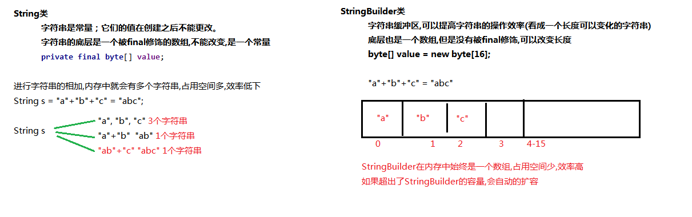

# Java StringBuilder API | No.11

此文为 Java API 系列内容，此节整理 **StringBuilder  API** 中的常用API 。

本系列教程，均使用 ` IntelliJ IDEA ` 作为 默认 `IDE`  进行讲解。
文中出现的代码或者提供的外链，也请下载 ` IntelliJ IDEA ` 后打开；
使用`Eclipse`的朋友自理，新人也可先使用 `VS Code ` 作为文本编辑器。


> 注意：Java 的源代码文件后缀均为 `.java` 
> 有代码的文章，都不推荐手机阅读，觉得此文不错，建议电脑打开再阅读一遍，味道更佳~

**Java API  系列文章安排分为3部分**：

1. 类的概述 及 常用 API 方法列表及释义。
2. 常用方法代码实操和可能会遇到的注意事项。
3. 最后还会提供完整的实战 Demo代码，以及 GitHub 地址。

#### 一、概述 及 常用 API 方法

`java.lang.StringBuilder`：一个可变的字符序列。
此类提供一个与 `StringBuffer` 兼容的 API，但不保证同步(线程不安全)。
该类被设计用作 `StringBuffer` 的一个简易替换，用在字符串缓冲区被单个线程使用的时候（这种情况很普遍）。
如果可能，建议优先采用该类，因为在大多数实现中，它比 `StringBuffer` 要快。

StringBuilder的原理：



##### 构造方法

`StringBuilder()`：构造一个不带任何字符的字符串生成器，其初始容量为 `16` 个字符。

`StringBuilder(String str)`： 构造一个字符串生成器，并初始化为指定的字符串内容。
该字符串生成器的初始容量为 16 加上字符串参数的长度。

代码例子如下：

```java
// 空参数构造方法
StringBuilder sb1 = new StringBuilder();
System.out.println("sb1:" + sb1);//sb1:""

// 带字符串的构造方法
StringBuilder sb2 = new StringBuilder("abc");
System.out.println("sb2:" + sb2);//sb2:abc
```

<br/>

##### StringBuilder 常用 API

根据JDK源代码及 StringBuilder 类的 API 文档，StringBuilder 类当中常用的方法如下：

`public StringBuilder append(...)`：添加任意类型数据的字符串形式，并返回当前对象自身。

`public String toString()` ：返回此序列中数据的字符串表示形式。
将分配一个新的 String 对象，并将它初始化，以包含当前由此对象表示的字符串序列。
然后返回此 String。对此序列的后续更改不影响该 String 的内容。

`public int indexOf(String str)`：返回第一次出现的指定子字符串在该字符串中的索引。

`public int lastIndexOf(String str)`：返回最右边出现的指定子字符串在此字符串中的索引。
将最右边的空字符串 "" 视为出现在索引值 this.length() 处。

`public StringBuilder deleteCharAt(int index)`： 移除此序列指定位置上的 char。此序列将缩短一个 char。
注：如果给定索引处的字符是增补字符，则此方法将不会移除整个字符。

`public String toString()`：返回该对象的字符串形式。

<br/>

下面对常用 API 进行 实操：

```java
//创建StringBuilder对象
StringBuilder bu = new StringBuilder();
//使用append方法往StringBuilder中添加数据
//append方法返回的是this,调用方法的对象bu,this==bu
//StringBuilder sb2 = bu.append("abc");//把bu的地址赋值给了sb2
//System.out.println(bu);//"abc"
//System.out.println(sb2);//"abc"
//System.out.println(bu==sb2);//比较的是地址 true

//使用append方法无需接收返回值
// bu.append("abc");
// bu.append(1);
// bu.append(true);
// bu.append(8.8);
// bu.append('中');
// System.out.println(bu);//abc1true8.8中

/*
		链式编程:方法返回值是一个对象,可以继续调用方法
*/
System.out.println("abc".toUpperCase().toLowerCase().toUpperCase().toLowerCase());
bu.append("abc").append(1).append(true).append(8.8).append('中');
System.out.println(bu);//abc1true8.8中

```

<br/>

StringBuilder和String可以相互转换，方法如下：

1.String->StringBuilder: 可以使用StringBuilder的构造方法
StringBuilder(String str) 构造一个字符串生成器，并初始化为指定的字符串内容。

2.StringBuilder->String:可以使用StringBuilder中的toString方法
public String toString()：将当前StringBuilder对象转换为String对象。

<br/>

```java
//String->StringBuilder
String str = "hello";
System.out.println("str:" + str);
bu = new StringBuilder(str);
//往StringBuilder中添加数据
bu.append("world");
System.out.println("bu:" + bu);

//StringBuilder->String
String s = bu.toString();
System.out.println("s:" + s);
```

<br/>

查找指定字符在 `StringBuilder` 的下标：

```java
// indexOf
bu = new StringBuilder().append("Mr.Dragon.");
System.out.println("index = " + bu.indexOf("r"));

// lastIndexOf
System.out.println("last index = " + bu.lastIndexOf("r"));
```
<br/>

##### 练习题

> 将 "Mr.Dragon." 变成 "Mr.Dragon"(删除最后一个点)

```java
// deleteCharAt
bu = bu.deleteCharAt(bu.lastIndexOf("."));
System.out.println("result = " + bu);
```

#### 二、完整的 Demo 代码

本文完整实例 Demo 代码，可直接 copy 到 IDE 执行测试，也可以点击文末提供的源代码地址进行下载。

<br/>

```java
package com.dragon.demo6.stringbuilder;

/**
 * @author dragon
 * @version V0.1
 * @title: com.dragon.demo6.stringbuilder.StringBuilderApiDemo
 * @description: Java语言中的 可变的字符序列：StringBuilder 的 API Demo
 * @document: https://docs.oracle.com/javase/8/docs/api/
 * @date 2019/08/13
 */
public class StringBuilderApiDemo {

  /**
   * 为方便大家直接运行代码，前期都使用 main 方法的形式写demo
   */
  public static void main(String[] args) {
    /*
    java.lang.StringBuilder类:字符串缓冲区,可以提高字符串的效率
    构造方法:
        StringBuilder() 构造一个不带任何字符的字符串生成器，其初始容量为 16 个字符。
        StringBuilder(String str) 构造一个字符串生成器，并初始化为指定的字符串内容。
        该字符串生成器的初始容量为 16 加上字符串参数的长度。
    */

    // 空参数构造方法
    StringBuilder sb1 = new StringBuilder();
    System.out.println("sb1:" + sb1);//sb1:""

    // 带字符串的构造方法
    StringBuilder sb2 = new StringBuilder("abc");
    System.out.println("sb2:" + sb2);//sb2:abc

    //  ====================
    /*
      StringBuilder的常用方法:
          public StringBuilder append(...)：添加任意类型数据的字符串形式，并返回当前对象自身。

          public String toString() ：返回此序列中数据的字符串表示形式。
          将分配一个新的 String 对象，并将它初始化，以包含当前由此对象表示的字符串序列。
          然后返回此 String。对此序列的后续更改不影响该 String 的内容。

          public int indexOf(String str)：返回第一次出现的指定子字符串在该字符串中的索引。
          public int lastIndexOf(String str)：返回最右边出现的指定子字符串在此字符串中的索引。
          将最右边的空字符串 "" 视为出现在索引值 this.length() 处。

          public StringBuilder deleteCharAt(int index)： 移除此序列指定位置上的 char。此序列将缩短一个 char。
          注：如果给定索引处的字符是增补字符，则此方法将不会移除整个字符。
   */
    //创建StringBuilder对象
    StringBuilder bu = new StringBuilder();
    //使用append方法往StringBuilder中添加数据
    //append方法返回的是this,调用方法的对象bu,this==bu
    //StringBuilder sb2 = bu.append("abc");//把bu的地址赋值给了sb2
    //System.out.println(bu);//"abc"
    //System.out.println(sb2);//"abc"
    //System.out.println(bu==sb2);//比较的是地址 true

    //使用append方法无需接收返回值
    // bu.append("abc");
    // bu.append(1);
    // bu.append(true);
    // bu.append(8.8);
    // bu.append('中');
    // System.out.println(bu);//abc1true8.8中

    /*
        链式编程:方法返回值是一个对象,可以继续调用方法
    */
    System.out.println("abc".toUpperCase().toLowerCase().toUpperCase().toLowerCase());
    bu.append("abc").append(1).append(true).append(8.8).append('中');
    System.out.println(bu);//abc1true8.8中

    //  =====================
  /*
    StringBuilder和String可以相互转换:

    1.String->StringBuilder:可以使用StringBuilder的构造方法
      StringBuilder(String str) 构造一个字符串生成器，并初始化为指定的字符串内容。
    2.StringBuilder->String:可以使用StringBuilder中的toString方法
      public String toString()：将当前StringBuilder对象转换为String对象。
  */

    //String->StringBuilder
    String str = "hello";
    System.out.println("str:" + str);
    bu = new StringBuilder(str);
    //往StringBuilder中添加数据
    bu.append("world");
    System.out.println("bu:" + bu);

    //StringBuilder->String
    String s = bu.toString();
    System.out.println("s:" + s);

    // indexOf
    bu = new StringBuilder().append("Mr.Dragon.");
    System.out.println("index = " + bu.indexOf("r"));

    // lastIndexOf
    System.out.println("last index = " + bu.lastIndexOf("r"));


    //  ======== 练习题 ==========
    //  将 "Mr.Dragon." 变成 "Mr.Dragon"(删除最后一个点)

    // deleteCharAt
    bu = bu.deleteCharAt(bu.lastIndexOf("."));
    System.out.println("result = " + bu);

  }
}
```

> 小贴士：直接使用输出语句输出对象名的时候,其实通过该对象调用了其toString()方法。

<br/>

#### 三、总结

1. `StringBuilder` 的概述 及 常用 `API` 列表及释义
2. 代码实操，指出一些会遇到的问题
3. 提供一个简单的小练习

<br/>

#### References

1. [本文代码地址&API文档下载地址](https://github.com/mr-dragon/java-basic-demo)

2. [Java系列IT技术教程汇总](http://mp.weixin.qq.com/mp/homepage?__biz=MzAwMTE2MzA1Mg==&hid=3)

3. [IntelliJ IDEA 简体中文专题教程](https://github.com/judasn/IntelliJ-IDEA-Tutorial)

4. [VS Code 基础教程](https://mp.weixin.qq.com/s/E2uhf2a6TAPHTxltkq-9hw)
