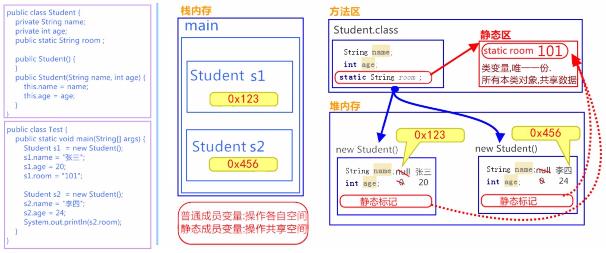

# Java static 关键字| No.12

此文为 Java basic 系列内容，此节整理 **static** 关键字 相关内容 。

本系列教程，均使用 ` IntelliJ IDEA ` 作为 默认 `IDE`  进行讲解。
文中出现的代码或者提供的外链，也请下载 ` IntelliJ IDEA ` 后打开；
使用`Eclipse`的朋友自理，新人也可先使用 `VS Code ` 作为文本编辑器。


> 注意：Java 的源代码文件后缀均为 `.java` 
> 有代码的文章，都不推荐手机阅读，觉得此文不错，建议电脑打开再阅读一遍，味道更佳~

**本文内容**：

1. 关键字 `static` 的概述 及 常用 方式。
2. 静态变量、静态方法、静态块 释义和代码示例。
3. 提供完整的实战 Demo 代码，以及 GitHub 地址。

#### 一、static 概述

Java 中的`static`关键字主要用于内存管理。
我们可以应用 java `static`关键字在变量，方法，块和嵌套类中。 
`static`关键字被修饰的成员是属于类的，而不是类的实例。
既然属于类，就可以不靠创建对象来调用了。

静态 (`static`) 可以是：

1.  变量 (也称为类变量/静态变量)
2.  方法 (也称为类方法)
3.  代码块
4.  嵌套类

#### 二、Java 类变量/静态变量

如果将一个变量声明为`static`，它就是所谓的`静态变量`了，或者叫：`类变量`

定义格式:

```java
static 数据类型 变量名;
```

举例：
```java
static int numberId;
```

> 静态变量可以用于所有对象的公共属性 (对于每个对象不是唯一的，共有的)。如：员工公司名称，学生所在的大学名称。

##### 静态变量的优点

它能使程序存储器高效 (即它节省内存)。

##### 理解不使用静态变量的问题

```java
class Student{  
     int rollno;  
     String name;  
     String college="ITS";  
}
```

假设在一所学校有`500`名学生，现在所有实例数据成员将在每次创建对象时获取内存。
所有学生都有其唯一的注册 ID：`rollno`和　`name` ，因此实例数据成员没有什么问题。
`college` 指的是所有对象的共同属性。如果使它静态化 (使用`static`关键字修饲)，这个字段将只获得内存一次。

> Java 静态属性被共享给所有对象。


##### 静态变量的示例

新班开班，学员报到。现在想为每一位新来报到的同学编学号(id)，从第一名同学开始，id为 1，以此类推。
学号必须是**唯一的，连续的**，并且与班级的人数相符，这样以便知道，要分配给下一名新同学的学号是多少。
这样我们就需要一个变量，与单独的每一个学生对象无关，而是与整个班级同学数量有关。
所以，我们可以这样定义一个静态变量 `numberOfStudent` ，代码如下:

```java
public class Student { 
	 private int id; // 学号
    private String name; // 姓名
    private int age; // 年龄
    static String room; // 所在教室
    private static int numberOfStudent = 0; // 学号计数器，每当new了一个新对象的时候，计数器++

    public Student() {
        this.id = ++numberOfStudent;
    }

    public Student(String name, int age) {
        this.name = name;
        this.age = age;
        this.id = ++numberOfStudent;
    }

    // 打印属性值
    public void show() {
        System.out.println("Student : name=" + name + ", age=" + age + ", id=" + id);
    }

		// get set
}
```

示例代码及执行结果如下：

```java
Student two = new Student("黄蓉", 16);
two.room = "101教室";
two.show();

Student one = new Student("郭靖", 19);
one.show();

//Student : name=黄蓉, age=16, id=1
//Student : name=郭靖, age=19, id=2

```

<br/>


#### 三、Java 静态方法

如果在任何方法上应用`static`关键字，此方法称为`静态方法` ，或 `类方法`。

1. 静态方法属于类，而不属于类的对象。
2. 可以直接调用静态方法，而无需创建类的实例。(推荐调用方式)
3. 静态方法可以访问静态数据成员，并可以更改静态数据成员的值。


定义格式:

```java
 修饰符 static 返回值类型 方法名 (参数列表){ 
	 // 执行语句
}
```

<br/>

**静态方法的示例**

```java
package com.dragon.demo7.staticdemo;

public class MyClass {

  int num; // 成员变量
  static int numStatic; // 静态变量

  // 成员方法
  public void method() {
    System.out.println("这是一个成员方法。");
    // 成员方法可以访问成员变量
    System.out.println(num);
    // 成员方法可以访问静态变量
    System.out.println(numStatic);
  }

  // 静态方法
  public static void methodStatic() {
    System.out.println("这是一个静态方法。");
    // 静态方法可以访问静态变量
    System.out.println(numStatic);
    // 静态不能直接访问非静态【重点】
    // System.out.println(num); // 错误写法！

    // 静态方法中不能使用this关键字。
    // System.out.println(this); // 错误写法！
  }
}
```

<br/>

**静态方法的注意事项**

静态方法有两个主要限制。它们分别是：

1. 静态方法不能直接使用`非静态`数据成员或调用非静态方法。反之，成员方法可以直接访问类变量或静态方法。
2. `this`和`super`两个关键字不能在静态上下文中使用。

>小贴士:静态方法只能访问静态成员。

**为什么 java main 方法是静态的？**

这是因为对象不需要调用静态方法，如果它是非静态方法，jvm 首先要创建对象，然后调用 main() 方法，这将导致额外的内存分配的问题。


**可以执行程序没有 main() 方法吗？**  
**答：** 可以，一种方式是静态块，但是在旧的 JDK 版本中，而不是在 JDK 1.7 +。

```java
class A3 {
    static {
        System.out.println("static block is invoked");
        System.exit(0);
    }
}
```

上面代码执行输出以下结果:

```java
static block is invoked
```

在 JDK7 及以上版本中，输出将为：

```java
错误: 在类 Main 中找不到 main 方法, 请将 main 方法定义为:
public static void main(String[] args)
```

<br/>

**静态原理图解**

`static` 修饰的内容:
1. 是随着类的加载而加载的，且只加载一次。
2. 存储于一块固定的内存区域(静态区)，所以，可以直接被类名调用。
3. 它优先于对象存在，所以，可以被所有对象共享。



#### 四、Java 静态代码块

静态代码块:定义在成员位置，使用 `static` 修饰的代码块`{ }`。

1. 位置:类中方法外。
2. 用于初始化静态数据成员。
3. 它在类加载时在 main 方法之前执行。

##### 静态块的示例

<br/>

```java
public class ClassName{ 
	static {
		// 执行语句
	}
}
```

作用:给类变量进行初始化赋值。用法演示，代码如下:

```java
public class Game {
  public static int number;
  public static ArrayList<String> list;

  static {
		// 给类变量赋值
		number = 2;
		list = new ArrayList<String>(); // 添加元素到集合中 list.add("张三"); list.add("李四");
	}
}

```

<br/>

#### 五、总结

1. static 关键字，可以修饰变量、方法和代码块。
2. 在使用的过程中，其主要目的还是想在不创建对象的情况下去调用方法。
3. 提供完整的实战 Demo 代码，以及 GitHub 地址。

<br/>

#### References

1. [本文代码地址&API文档下载地址](https://github.com/mr-dragon/java-basic-demo)

2. [Java系列IT技术教程汇总](http://mp.weixin.qq.com/mp/homepage?__biz=MzAwMTE2MzA1Mg==&hid=3)

3. [IntelliJ IDEA 简体中文专题教程](https://github.com/judasn/IntelliJ-IDEA-Tutorial)

4. [VS Code 基础教程](https://mp.weixin.qq.com/s/E2uhf2a6TAPHTxltkq-9hw)

5. [Java static 关键字](https://www.yiibai.com/java/static-keyword-in-java.html)
