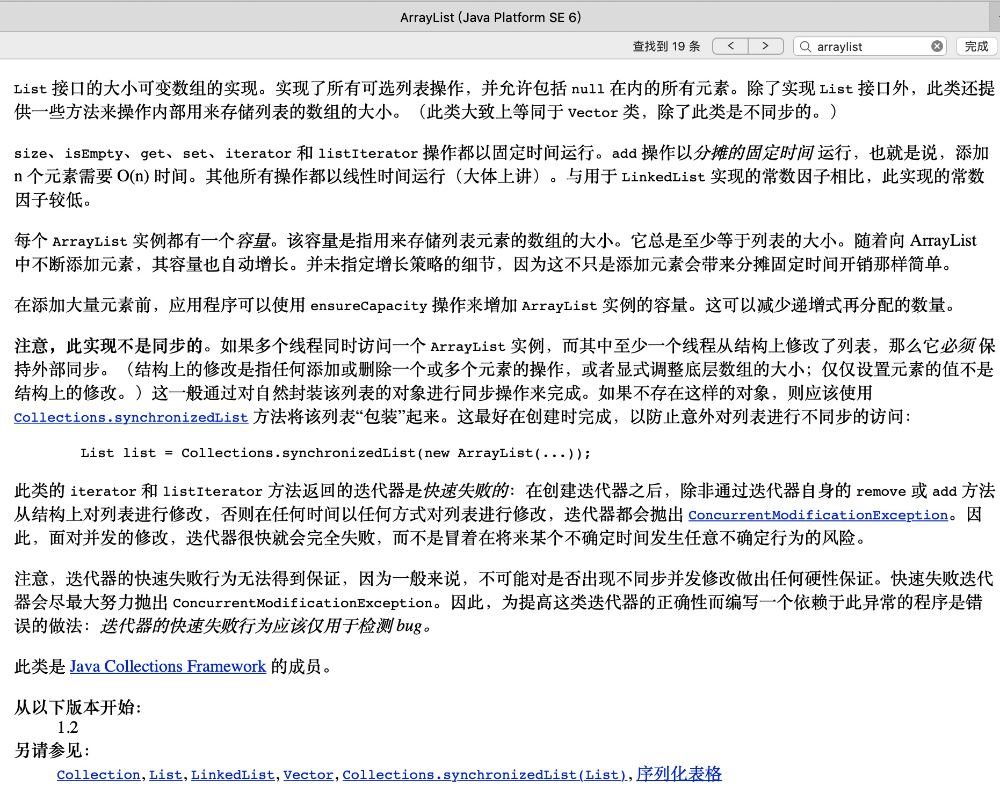

# Java ArrayList API | No.13

此文为 Java API 系列内容，此节整理 **ArrayList  API** 中的常用API 。

本系列教程，均使用 ` IntelliJ IDEA ` 作为 默认 `IDE`  进行讲解。
文中出现的代码或者提供的外链，也请下载 ` IntelliJ IDEA ` 后打开；
使用`Eclipse`的朋友自理，新人也可先使用 `VS Code ` 作为文本编辑器。


> 注意：Java 的源代码文件后缀均为 `.java` 
> 有代码的文章，都不推荐手机阅读，觉得此文不错，建议电脑打开再阅读一遍，味道更佳~

**Java API  系列文章安排分为3部分**：

1. 类的概述 及 常用 API 方法列表及释义。
2. 常用方法代码实操和可能会遇到的注意事项。
3. 最后还会提供完整的实战 Demo 代码，以及 GitHub 地址。

#### 一、概述 及 常用 API 列表

`java.util.ArrayList`类是 Java 语言中的 **有序可重复** 的集合类。

我们先看一个题：

> 定义一个数组，用来存储3个 Person 对象。

```java
 // 首先创建一个长度为3的数组，里面用来存放Person类型的对象
Person[] array = new Person[3];

Person one = new Person("迪丽热巴", 18);
Person two = new Person("古力娜扎", 28);
Person three = new Person("玛尔扎哈", 38);

// 将one当中的地址值赋值到数组的0号元素位置
array[0] = one;
array[1] = two;
array[2] = three;

System.out.println(array[0]); // 地址值
System.out.println(array[1]); // 地址值
System.out.println(array[2]); // 地址值

System.out.println(array[1].getName()); // 古力娜扎
```

数组有一个缺点：一旦创建，程序运行期间长度不可以发生改变。

拿我们看看 `API` 中 是怎么描述`ArrayList` 的：



数组的长度不可以发生改变。
从API 第一句话可以看到 ： `List` 接口的大小可变数组的实现，所以 `ArrayList` 集合的长度是可以随意变化的。

对于 `ArrayList` 来说，有一个尖括号 `<E>` 代表泛型。
`泛型`：也就是装在集合当中的所有元素，全都是统一的什么类型。
注意：泛型只能是引用类型，不能是基本类型。

注意事项：
对于 `ArrayList` 集合来说，直接打印得到的不是地址值，而是内容。
如果内容是空，得到的是空的中括号：`[]`

下面看看代码如何写：

```java
// 创建了一个ArrayList集合，集合的名称是list，里面装的全都是String字符串类型的数据
// 备注：从 JDK 1.7+ 开始，右侧的尖括号内部可以不写内容，但是 <> 本身还是要写的。

ArrayList<String> list = new ArrayList<>();
System.out.println(list); // []

// 向集合当中添加一些数据，需要用到add方法。
list.add("赵丽颖");
System.out.println(list); // [赵丽颖]

list.add("迪丽热巴");
list.add("古力娜扎");
list.add("玛尔扎哈");
System.out.println(list); // [赵丽颖, 迪丽热巴, 古力娜扎, 玛尔扎哈]

// 错误写法！因为创建的时候尖括号泛型已经说了是字符串，添加进去的元素就必须都是字符串才行
// list.add(100);
```

##### ArrayList 的常用 API

根据JDK源代码及 `ArrayList` 类的 API 文档， `ArrayList` 类当中常用方法如下：

`public boolean add(E e)`：向集合当中添加元素，参数的类型和泛型一致。返回值代表添加是否成功。
备注：对于 `ArrayList` 集合来说， `add` 添加动作一定是成功的，所以返回值可用可不用。
但是对于其他集合（今后学习）来说， `add` 添加动作不一定成功。

`public E get(int index)`：从集合当中获取元素，参数是索引编号，返回值就是对应位置的元素。

`public E remove(int index)`：从集合当中删除元素，参数是索引编号，返回值就是被删除掉的元素。

`public int size()`：获取集合的尺寸长度，返回值是集合中包含的元素个数。

`public String toString()`：返回该对象的字符串形式。


以上 `API`  代码实战如下：

```java
list = new ArrayList<>();
System.out.println(list); // []

// 向集合中添加元素：add
boolean success = list.add("柳岩");
System.out.println(list); // [柳岩]
System.out.println("添加的动作是否成功：" + success); // true

list.add("高圆圆");
list.add("赵又廷");
list.add("李小璐");
list.add("贾乃亮");
System.out.println(list); // [柳岩, 高圆圆, 赵又廷, 李小璐, 贾乃亮]

// 从集合中获取元素：get。索引值从0开始
String name = list.get(2);
System.out.println("第2号索引位置：" + name); // 赵又廷

// 从集合中删除元素：remove。索引值从0开始。
String whoRemoved = list.remove(3);
System.out.println("被删除的人是：" + whoRemoved); // 李小璐
System.out.println(list); // [柳岩, 高圆圆, 赵又廷, 贾乃亮]

// 获取集合的长度尺寸，也就是其中元素的个数
int size = list.size();
System.out.println("集合的长度是：" + size);
```

##### 遍历集合

```java
list = new ArrayList<>();
list.add("迪丽热巴");
list.add("古力娜扎");
list.add("玛尔扎哈");

// 遍历集合
for (int i = 0; i < list.size(); i++) {
	System.out.println(list.get(i));
}

for (String s : list) {
	System.out.println(s);
}
```

##### 集合中存储 存储基本类型

 如果希望向集合ArrayList当中存储基本类型数据，必须使用基本类型对应的“包装类”。

```java

//基本类型    包装类（引用类型，包装类都位于java.lang包下）
byte        Byte
short       Short
int         Integer   【特殊】
long        Long
float       Float
double      Double
char        Character 【特殊】
boolean     Boolean
```

从JDK 1.5+开始，支持自动装箱、自动拆箱。

自动装箱：基本类型 --> 包装类型
自动拆箱：包装类型 --> 基本类型

示例代码如下：

```java
ArrayList<String> listA = new ArrayList<>();
// 错误写法！泛型只能是引用类型，不能是基本类型
// ArrayList<int> listB = new ArrayList<>();

ArrayList<Integer> listC = new ArrayList<>();
listC.add(100);
listC.add(200);
System.out.println(listC); // [100, 200]

int num = listC.get(1);
System.out.println("第1号元素是：" + num);
```

#### 二、完整的实战 Demo

本文关于 `ArrayList`  常用 API 实例 Demo 代码 如下。

可直接 copy 到 IDE 执行测试，也可以点击文末提供的源代码地址进行下载。

```java
package com.dragon.demo8.arraylist;

import java.util.ArrayList;

/**
 * @author dragon
 * @version V0.1
 * @title: com.dragon.demo8.arraylist.ArrayListApiDemo
 * @description: Java语言中的 有序可重复的集合类：ArrayList 的 API Demo
 * @document: https://docs.oracle.com/javase/8/docs/api/
 * @date 2019/08/13 22:39
 */
public class ArrayListApiDemo {

  /**
   * 为方便大家直接运行代码，前期都使用 main 方法的形式写demo
   */
  public static void main(String[] args) {
    /*
    题目：
    定义一个数组，用来存储3个 Person 对象。

    数组有一个缺点：一旦创建，程序运行期间长度不可以发生改变。
   */

    // 首先创建一个长度为3的数组，里面用来存放Person类型的对象
    Person[] array = new Person[3];

    Person one = new Person("迪丽热巴", 18);
    Person two = new Person("古力娜扎", 28);
    Person three = new Person("玛尔扎哈", 38);

    // 将one当中的地址值赋值到数组的0号元素位置
    array[0] = one;
    array[1] = two;
    array[2] = three;

    System.out.println(array[0]); // 地址值
    System.out.println(array[1]); // 地址值
    System.out.println(array[2]); // 地址值

    System.out.println(array[1].getName()); // 古力娜扎

    // =============
    /*
      数组的长度不可以发生改变。
      但是ArrayList集合的长度是可以随意变化的。

      对于ArrayList来说，有一个尖括号<E>代表泛型。
      泛型：也就是装在集合当中的所有元素，全都是统一的什么类型。
      注意：泛型只能是引用类型，不能是基本类型。

      注意事项：
      对于ArrayList集合来说，直接打印得到的不是地址值，而是内容。
      如果内容是空，得到的是空的中括号：[]
    */

    // 创建了一个ArrayList集合，集合的名称是list，里面装的全都是String字符串类型的数据
    // 备注：从 JDK 1.7+ 开始，右侧的尖括号内部可以不写内容，但是 <> 本身还是要写的。

    ArrayList<String> list = new ArrayList<>();
    System.out.println(list); // []

    // 向集合当中添加一些数据，需要用到add方法。
    list.add("赵丽颖");
    System.out.println(list); // [赵丽颖]

    list.add("迪丽热巴");
    list.add("古力娜扎");
    list.add("玛尔扎哈");
    System.out.println(list); // [赵丽颖, 迪丽热巴, 古力娜扎, 玛尔扎哈]

    // 错误写法！因为创建的时候尖括号泛型已经说了是字符串，添加进去的元素就必须都是字符串才行
    // list.add(100);

    /*
      ArrayList当中的常用方法有：

      public boolean add(E e)：向集合当中添加元素，参数的类型和泛型一致。返回值代表添加是否成功。
      备注：对于ArrayList集合来说，add添加动作一定是成功的，所以返回值可用可不用。
      但是对于其他集合（今后学习）来说，add添加动作不一定成功。

      public E get(int index)：从集合当中获取元素，参数是索引编号，返回值就是对应位置的元素。

      public E remove(int index)：从集合当中删除元素，参数是索引编号，返回值就是被删除掉的元素。

      public int size()：获取集合的尺寸长度，返回值是集合中包含的元素个数。
    */

    list = new ArrayList<>();
    System.out.println(list); // []

    // 向集合中添加元素：add
    boolean success = list.add("柳岩");
    System.out.println(list); // [柳岩]
    System.out.println("添加的动作是否成功：" + success); // true

    list.add("高圆圆");
    list.add("赵又廷");
    list.add("李小璐");
    list.add("贾乃亮");
    System.out.println(list); // [柳岩, 高圆圆, 赵又廷, 李小璐, 贾乃亮]

    // 从集合中获取元素：get。索引值从0开始
    String name = list.get(2);
    System.out.println("第2号索引位置：" + name); // 赵又廷

    // 从集合中删除元素：remove。索引值从0开始。
    String whoRemoved = list.remove(3);
    System.out.println("被删除的人是：" + whoRemoved); // 李小璐
    System.out.println(list); // [柳岩, 高圆圆, 赵又廷, 贾乃亮]

    // 获取集合的长度尺寸，也就是其中元素的个数
    int size = list.size();
    System.out.println("集合的长度是：" + size);


    // =====  遍历集合 =======
    list = new ArrayList<>();
    list.add("迪丽热巴");
    list.add("古力娜扎");
    list.add("玛尔扎哈");

    // 遍历集合
    for (int i = 0; i < list.size(); i++) {
      System.out.println(list.get(i));
    }

    for (String s : list) {
      System.out.println(s);
    }

    // ===== 集合中存储 存储基本类型 ====
    /*
      如果希望向集合ArrayList当中存储基本类型数据，必须使用基本类型对应的“包装类”。

      基本类型    包装类（引用类型，包装类都位于java.lang包下）
      byte        Byte
      short       Short
      int         Integer     【特殊】
      long        Long
      float       Float
      double      Double
      char        Character   【特殊】
      boolean     Boolean

      从JDK 1.5+开始，支持自动装箱、自动拆箱。

      自动装箱：基本类型 --> 包装类型
      自动拆箱：包装类型 --> 基本类型
    */

    ArrayList<String> listA = new ArrayList<>();
    // 错误写法！泛型只能是引用类型，不能是基本类型
    // ArrayList<int> listB = new ArrayList<>();

    ArrayList<Integer> listC = new ArrayList<>();
    listC.add(100);
    listC.add(200);
    System.out.println(listC); // [100, 200]

    int num = listC.get(1);
    System.out.println("第1号元素是：" + num);

  }
}
```


#### 三、ArrayList 的 4道练习题

##### 题1

生成6个1~33之间的随机整数，添加到集合，并遍历集合。

思路：
1. 需要存储6个数字，创建一个集合，<Integer>
2. 产生随机数，需要用到Random
3. 用循环6次，来产生6个随机数字：for循环
4. 循环内调用r.nextInt(int n)，参数是33，0~32，整体+1才是1~33
5. 把数字添加到集合中：add
6. 遍历集合：for、size、get

<br/>

```java
ArrayList<Integer> list = new ArrayList<>();
Random r = new Random();
for (int i = 0; i < 6; i++) {
  int num = r.nextInt(33) + 1;
  list.add(num);
}
// 遍历集合
for (int i = 0; i < list.size(); i++) {
  System.out.println(list.get(i));
}
```

<br/>

##### 题2

自定义4个学生对象，添加到集合，并遍历。

思路：
1. 自定义Student学生类，四个部分。
2. 创建一个集合，用来存储学生对象。泛型：<Student>
3. 根据类，创建4个学生对象。
4. 将4个学生对象添加到集合中：add
5. 遍历集合：for、size、get

<br/>

```java
ArrayList<Student> list2 = new ArrayList<>();

Student one = new Student("洪七公", 20);
Student two = new Student("欧阳锋", 21);
Student three = new Student("黄药师", 22);
Student four = new Student("段智兴", 23);

list2.add(one);
list2.add(two);
list2.add(three);
list2.add(four);

// 遍历集合
for (int i = 0; i < list.size(); i++) {
    Student stu = list2.get(i);
    System.out.println("姓名：" + stu.getName() + "，年龄" + stu.getAge());
}
```

<br/>

##### 题3

定义以指定格式打印集合的方法(`ArrayList`类型作为参数)，使用`{}`扩起集合，使用`@`分隔每个元素。

格式参照 {元素@元素@元素}。

System.out.println(list);       [10, 20, 30]
printArrayList(list);           {10@20@30}

<br/>

```java

 ArrayList<String> list3 = new ArrayList<>();
list3.add("张三丰");
list3.add("宋远桥");
list3.add("张无忌");
list3.add("张翠山");
System.out.println(list3); // [张三丰, 宋远桥, 张无忌, 张翠山]

printArrayList(list3);

/*
   定义方法的三要素
   返回值类型：只是进行打印而已，没有运算，没有结果；所以用void
   方法名称：printArrayList
   参数列表：ArrayList
*/
public static void printArrayList(ArrayList<String> list) {
  // {10@20@30}
  System.out.print("{");
  for (int i = 0; i < list.size(); i++) {
    String name = list.get(i);
    if (i == list.size() - 1) {
      System.out.println(name + "}");
    } else {
      System.out.print(name + "@");
    }
  }
}

```

<br/>

##### 题4

用一个大集合存入20个随机数字，然后筛选其中的偶数元素，放到小集合当中。
要求使用自定义的方法来实现筛选。

分析：
1. 需要创建一个大集合，用来存储int数字：<Integer>
2. 随机数字就用Random nextInt
3. 循环20次，把随机数字放入大集合：for循环、add方法
4. 定义一个方法，用来进行筛选。
筛选：根据大集合，筛选符合要求的元素，得到小集合。
三要素
返回值类型：ArrayList小集合（里面元素个数不确定）
方法名称：getSmallList
参数列表：ArrayList大集合（装着20个随机数字）
5. 判断（if）是偶数：num % 2 == 0
6. 如果是偶数，就放到小集合当中，否则不放。

<br/>

```java
ArrayList<Integer> bigList = new ArrayList<>();
Random random = new Random();
for (int i = 0; i < 20; i++) {
    int num = random.nextInt(100) + 1; // 1~100
    bigList.add(num);
}

ArrayList<Integer> smallList = getSmallList(bigList);

System.out.println("偶数总共有多少个：" + smallList.size());
for (int i = 0; i < smallList.size(); i++) {
    System.out.println(smallList.get(i));
}

// 这个方法，接收大集合参数，返回小集合结果
public static ArrayList<Integer> getSmallList(ArrayList<Integer> bigList) {
    // 创建一个小集合，用来装偶数结果
    ArrayList<Integer> smallList = new ArrayList<>();
    for (int i = 0; i < bigList.size(); i++) {
        int num = bigList.get(i);
        if (num % 2 == 0) {
            smallList.add(num);
        }
    }
    return smallList;
}

//end~
```

<br/>

#### 四、总结

1. ArrayList 类的概述 及 API 方法列表及释义
2. 对常用方法进行实操，如何遍历集合
3. 如何在集合中存储 存储基本类型
4. ArrayList 的 4道练习题

#### References

1. [本文代码地址&API文档下载地址](https://github.com/mr-dragon/java-basic-demo)

2. [Java系列IT技术教程汇总](http://mp.weixin.qq.com/mp/homepage?__biz=MzAwMTE2MzA1Mg==&hid=3)

3. [IntelliJ IDEA 简体中文专题教程](https://github.com/judasn/IntelliJ-IDEA-Tutorial)

4. [VS Code 基础教程](https://mp.weixin.qq.com/s/E2uhf2a6TAPHTxltkq-9hw)
