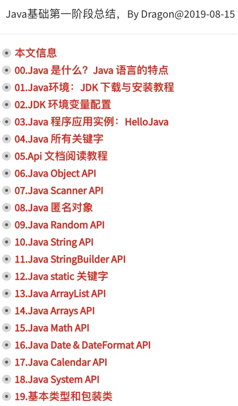

### 复习前面1-19的内容 | No.20

此文为 Java API 系列内容，此节整理 **复习前面1-19** 的内容 。

本系列教程，均使用 ` IntelliJ IDEA ` 作为 默认 `IDE`  进行讲解。
文中出现的代码或者提供的外链，也请下载 ` IntelliJ IDEA ` 后打开；
使用`Eclipse`的朋友自理，新人也可先使用 `VS Code ` 作为文本编辑器。

> 注意：Java 的源代码文件后缀均为 `.java` 
> 有代码的文章，都不推荐手机阅读，觉得此文不错，建议电脑打开再阅读一遍，味道更佳~

#### 一、前面学习的内容列表

- [00.Java 简介：Java 是什么？及 Java 语言的特点](https://mp.weixin.qq.com/s/XEP_KVWbnffkKDoPhXSolA)
- [01.Java环境：JDK 下载与安装教程](https://mp.weixin.qq.com/s/onNe9LR-V-ioShbewHe9Ag)
- [02.JDK 环境变量配置](https://mp.weixin.qq.com/s/lCQz0EmJo2uzDnYFR2KeKg)
- [03.Java 程序应用实例：HelloJava](https://mp.weixin.qq.com/s/AQIO1rPtgXBUMpjj3L1f3Q)
- [04.Java 语言 关键字](https://mp.weixin.qq.com/s/OAA5PAA5ynPqFF6NSWuPvQ)
- [05.Api 文档阅读教程](https://mp.weixin.qq.com/s/2YPGzmPVyLKbTAKUMzX6kQ)
- [06.Java Object API 详解](https://mp.weixin.qq.com/s/7ScoG_gRd7D7HPY5eHlBrQ)
- [07.Java Scanner API 详解](https://mp.weixin.qq.com/s/w7x4pBI-HQhzS7Tm1aTtmA)
- [08.Java 匿名对象 详解](https://mp.weixin.qq.com/s/PEA8Kh5jTngsxNXnXUMqPg)
- [09.Java Random API 详解](https://mp.weixin.qq.com/s/ZLTOAiaPnAp7pJ2Xntfjpg)
- [10.Java String API 详解](https://mp.weixin.qq.com/s/trVrgnRZrIbXFg64MMUCFQ)
- [11.Java StringBuilder API 详解](https://mp.weixin.qq.com/s/IZXYSy6qm7WsCjFZ2vByug)
- [12.Java static 关键字 详解](https://mp.weixin.qq.com/s/bdCc3YQzLFMKoMJJG39MMg)
- [13.Java ArrayList API 详解](https://mp.weixin.qq.com/s/uzTaioFMfbGNz-LUblQF9w)
- [14.Java Arrays API 详解](https://mp.weixin.qq.com/s/Gpwnq215m75zNC3aKX_5uw)
- [15.Java Math API 详解](https://mp.weixin.qq.com/s/pVetxE0HogVcE-W8QkDTgA)
- [16.Java Date  & DateFormat API 详解](https://mp.weixin.qq.com/s/JUxLFod-R4QAPJuyn81WLg)
- [17.Java Calendar API 详解](https://mp.weixin.qq.com/s/WombsaOkUtUOL2FGJD0n4Q)
- [18.Java System API 详解](https://mp.weixin.qq.com/s/hjFdwVHmXnuZ-YNaKiBpGg)
- [19.基本类型包装类 详解]()
- [20.复习前面1-19的内容]()

> 此系列内容大量参考了某马的课程，目的只为了快速复习总结Java基础内容。

#### 复习内容思维导图

#### 幕布大纲

以上复习内容，昨晚熬夜整理出来了幕布大纲，方便各位复习~

https://mubu.com/doc/f6GOKHmmo

#### References

1. [本文代码地址&API文档下载地址](https://github.com/mr-dragon/java-basic-demo)

2. [Java系列IT技术教程汇总](http://mp.weixin.qq.com/mp/homepage?__biz=MzAwMTE2MzA1Mg==&hid=3)

3. [IntelliJ IDEA 简体中文专题教程](https://github.com/judasn/IntelliJ-IDEA-Tutorial)